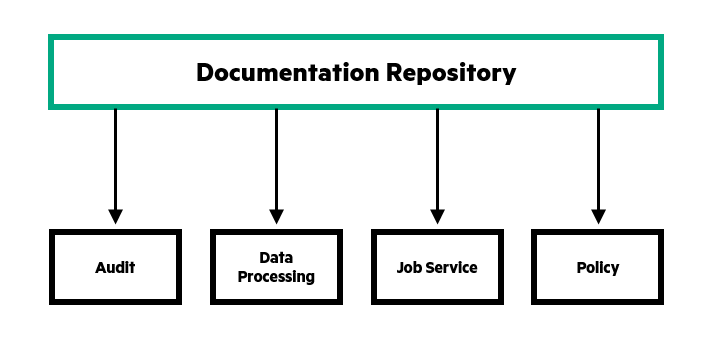

# Getting Started

This is the documentation repository. It is responsible for containing all the Jekyll files and layouts that should be used when writing documentation for CAF components. It also is responsible for providing the GitHub Pages site which can be found in the `gh-pages` branch.

### Documentation Repository Structure

The documentation repository contains all the files that are common across the whole documentation. The links displayed in the top navigation bar, the side navigation and the footer are defined within JSON files.

Each components or service should be responsible for containing the documentation that is specific to itself. The only files required in each repository are the markdown or HTML files that define the page content.

All repositories that contain documentation are added as a submodule to the documentation repository as illustrated in the diagram below.

One benefit of using submodules to contain documentation is that submodules capture the contents of a repository at a specific commit. Subsequently the documentation in the repository can be modified at any point without affecting the live version of the documentation. Only once the documentation is in a complete state, for example when a new version is being released, should the submodule be updated.

### Creating Documentation

Developers should write the documentation using markdown. Markdown is designed to be both easy to write and read and is essentially just text annotated with some punctuation that describes how the content should be displayed. Markdown is also rendered by GitHub so if someone is viewing the repository they can see the documentation in the correct format there too.

In your repository you should have a folder that will contain all your documentation files. The most commonly used naming convention for a documentation folder in a Git repository is `docs` (or alternatively `doc`).

In the interest of allowing localization of documents it is recommended that within the `docs` folder you add sub folders for each supported language. Even if the only language currently available is English, it is recommended that you follow this pattern regardless to avoid any later difficulties should documents ever get localized.

For more information on localization read our [guide to localization](localization.md).

In this `docs` folder you should add any markdown files required to fully document the component.

We have created several different layouts that are styled correctly and have all the required navigation functions already configured. Every markdown file should use one of these layouts.

More information on the various layouts available and how to use them can be found [here](using_layouts.md).

### Adding New Services

Once the documentation for your repository has been written you then need to add your service to the documentation site. 

The first step is to fork the caf-documentation repository and then clone it to your machine so you can begin making changes to the necessary files.

You then need to add your service repository as a submodule to the caf-documentation repository. Submodules are designed to be a way to include one repository within another and is essentially a snapshot at a specific point in time. For more information on submodules and how to add one go to the [submodules](submodules.md) page.

Once the submodule has been added we need to then need to update the site navigation so there are links pointing to your repository in the side menu. The links are added to the side_navigation.json file in the _data folder. For more information on updating the navigation items go to the [navigation](navigation.md) page.

The final step is to then submit a Pull Request to the caf-documentation site. This will then be reviewed and if there are no issues the documentation site will be updated with your new content.

