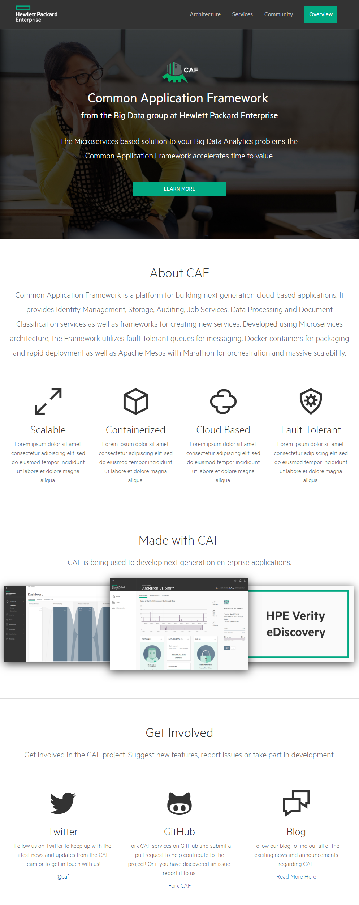
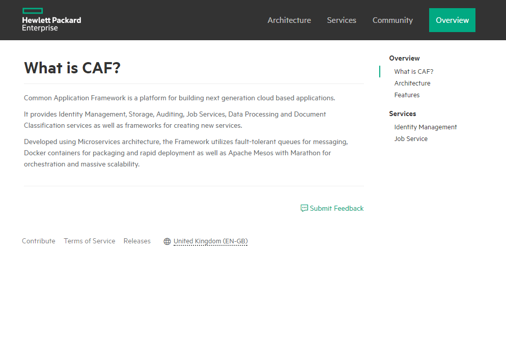
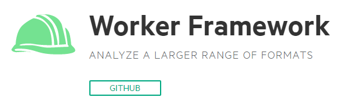
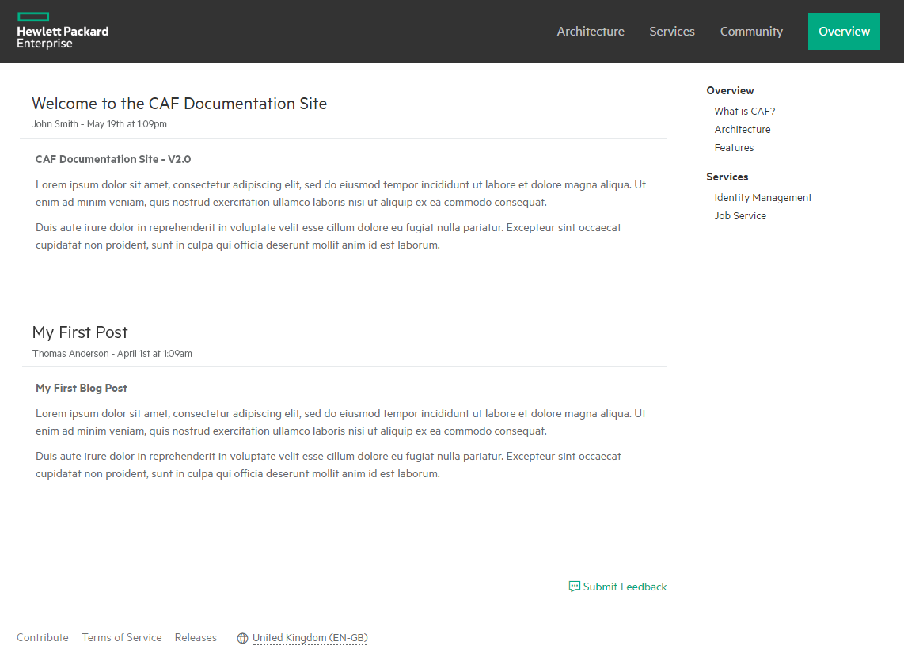
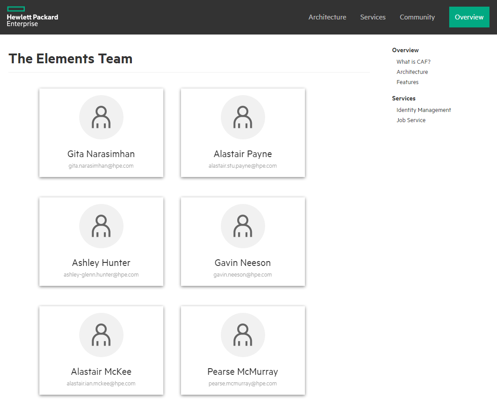
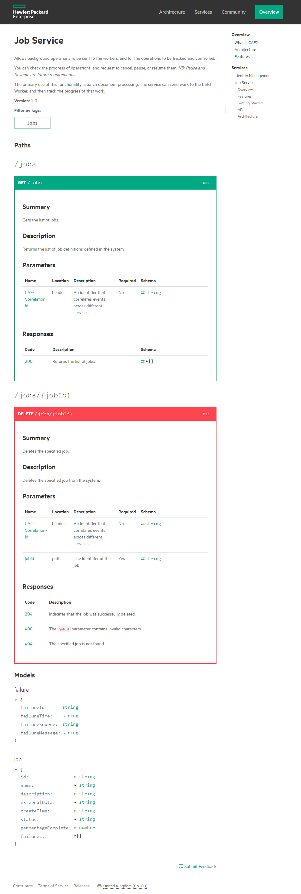

# Documentation Implementation Guide

#### Table of Contents
- [Getting Started](#getting-started)
- [Installing Prerequisites](#installing-prerequisites)
- [Creating Documentation](#creating-documentation)
- [Social Accounts](#social-accounts)
- [Writing Documentation](#writing-documentation)
- [Customizing The Site](#customizing-the-site)
- [Updating Showcase Site](#updating-showcase-site)

---

## Getting Started

The documentation site is a Jekyll project consisting of HPE themed layouts and all the necessary configuration to build and deploy your documentation site.

Using these layouts will provide a consistent user experience across all services.

## Installing Prerequisites

**(Fast track - start here if you were making changes to existing documentation site and want to test and publish your changes, but have not set anything up)**

Before installing any of the following software, the proxy settings need to be configured correctly. This can be set by using the following commands: (replace with the appropriate proxy and port).

```
set http_proxy=http://{{proxy}}:{{port}}  
set https_proxy=http://{{proxy}}:{{port}}
```

#### Git

Download [Git](http://git-scm.com/) to publish your documentation *(Requires v1.8 or higher)*.

#### Node.js

Node.js is a runtime environment for executing Javascript code outside of the browser. It comes bundled with **npm**, a tool that allows additional libraries to be easily installed.

Download and run the [Node.js installer](https://nodejs.org/en/download/).

#### Bower

Bower is a package manager and can be used to download the CAF Templates. Install **bower** and the **bower artifactory resolver** using the following commands:

```
npm install -g bower
npm install -g bower-art-resolver
```

#### Ruby

Download the [Ruby Installer](http://rubyinstaller.org/).

Run the installer, ensuring that you check the `Add Ruby executables to your PATH` option.

#### Ruby Developer Kit

Download the [Ruby Developer Kit](http://rubyinstaller.org).

Extract Ruby Developer Kit to a **DevKit** folder in the Ruby directory (Usually `C:\RubyXX-x64`). 

Navigate to the 'DevKit' directory in the Command Prompt, then we need to run the following commands:

```
ruby dk.rb init  
ruby dk.rb review  
ruby dk.rb install 
```

*If the DevKit fails to install, find the config.yml file in the DevKit folder and ensure it has detected your Ruby installation. If not, follow the instructions in the file to manually add the path.*

#### RubyGems

RubyGems is a package manager for Ruby, allowing quick and easy installation of Ruby applications or libraries.

Download [RubyGems](https://rubygems.org/pages/download).

Extract zip and navigate to the directory in Command Prompt (Run as Administrator). Install using the following command:

```
ruby setup.rb
```

#### Bundler

Bundler is an application that provides a consistent environment for Ruby projects by tracking and installing the exact gems and versions that are needed.

Enter the following in the Command Prompt to install Bundler:

```
gem install bundler
```

#### Grunt

Grunt is a task runner that allow the automation of tasks. We can use Grunt to easily build the documentation, host it on a local webserver and deploy the documentation site. Run the following command in the Command Prompt:

```
npm install -g grunt-cli
```

---

## Creating Documentation

**(Fast track - skip to the next fast track section if you were making changes to existing documentation site)**

Create a **docs** folder in the root of your repository to contain all documentation files. You should create the following files and folders within the **docs** directory. This folder should be added to the `develop` branch of your repository.

> **Note**: Documentation should not be modified in the `gh-pages` branch directly. This branch should be considered build output and will be overriden when documentation is published. 

**docs**
- **_data**
	+ **localizations**
		- documentation_localization_static.json
		- languages.json
	+ footer_links.json
	+ side_navigation.json
	+ top_navigation.json
- **_posts**
- **assets**
	+ **img**
	+ **css**
		- site.css
- **pages**
	+ **en-us**
		- **blog**
			+ index.html
		- overview.md
		- team.md
- .bowerrc
- .gitignore
- Gemfile
- Gruntfile.js
- _config.yml
- bower.json
- index.md
- package.json

---

### .bowerrc

This file configures bower to search Artifactory for the Elements package.

```
{
    "registry":
    {
        "search": [
            "http://rh7-artifactory.svs.hpeswlab.net:8081/artifactory/api/bower/bower-virtual"
        ]
    },
    "resolvers": [
        "bower-art-resolver"
    ],
    "directory": "."
}
```

### bower.json

This file contains information on the dependencies bower should install.

##### Checklist:

- [x] Change the `name` property to a suitable value
- [x] Change the `description` property to a suitable value

```
{
  "name": "my-framework",
  "description": "CAF Documentation Jekyll Project",
  "main": "",
  "authors": [],
  "homepage": "",
  "ignore": [
    "**/.*",
    "node_modules",
    "bower_components"
  ],
  "dependencies": {
    "caf-templates": "^2.0.5"
  }
}
```

### Gemfile

This file contains information on Jekyll's dependencies that Bundler will install.

```
source "https://rubygems.org"

gem 'rouge', '1.11.1'
gem 'jekyll-coffeescript', '1.0.1'
gem 'jekyll-watch', '1.5.0'
gem 'jekyll-assets', '2.2.5'
gem 'sprockets', '3.6.3'
gem 'jekyll', '3.1.6'
gem 'colorator', '0.1'
gem 'jekyll-paginate', '1.1.0'

gem 'wdm', '>= 0.1.0' if Gem.win_platform?
```

### Gruntfile.js

This file contains the configuration for several useful Grunt tasks. The available tasks which can be run from the command prompt are:

- `grunt build` - builds the documentation site
- `grunt serve` - builds the documentation site and watches for changes. Once a change is detected the documentation site is automatically rebuilt.
- `grunt update` - will update the bower packages to the latest version
- `grunt publish` - builds and pushes the documentation to the gh-pages branch of your repository.

##### Checklist:

- [x] Change the `remote` property to your repository url (SSH)

```
module.exports = function(grunt) {

    grunt.initConfig({
        jekyll: {
            build: {
                options: {
                    serve: false,
                    incremental: false,
                    watch: false,
                    config: '_config.yml',
                    bundleExec: true
                }
            },
            serve: {
                options: {
                    serve: true,
                    incremental: false,
                    watch: true,
                    baseurl: '/documentation',
                    config: '_config.yml',
                    open_url: true,
                    bundleExec: true
                }
            }
        },
        exec: {
            bower_install: 'bower install',
            bower_uninstall: 'bower uninstall caf-templates',
            bower_clean: 'bower cache clean'
        },
        buildcontrol: {
            options: {
                dir: '.',
                commit: true,
                push: true,
                connectCommits: false,
                message: 'Built %sourceName% from commit %sourceCommit% on branch %sourceBranch%'
            },
            pages: {
                options: {
                    remote: 'git@github.hpe.com:ashley-glenn-hunter/sample-docs.git',
                    login: '',
                    token: '',
                    branch: 'gh-pages'
                }
            }
        }
    });

    grunt.loadNpmTasks('grunt-build-control');
    grunt.loadNpmTasks('grunt-jekyll');
    grunt.loadNpmTasks('grunt-exec');

    grunt.registerTask('default', ['jekyll:build']);

    grunt.registerTask('build', ['jekyll:build']);
    grunt.registerTask('serve', ['jekyll:serve']);
    grunt.registerTask('update', ['exec:bower_uninstall', 'exec:bower_clean', 'exec:bower_install']);

    grunt.registerTask('publish', ['exec:bower_uninstall', 'exec:bower_clean', 'exec:bower_install', 'buildcontrol:pages']);
};
```

### _config.yml

This file contains configuration for your documentation site.

##### Checklist:

- [x] Change the `title` property to your service name
- [x] Set the `baseurl` property to the location of your hosted site (case sensitive)

```
title: My Service
# version: 1.0.0

description: My Service Description
baseurl: "//pages.github.hpe.com/caf/myservice"

# Set a custom logo in the navigation bar
# navigation_image: 'assets/img/my-service-logo.png'

# Provide a custom stylesheet to style you site
custom_stylesheet: 'assets/css/site.css'

# Build settings
exclude: ['node_modules']

markdown: kramdown
highlighter: rouge

gems: ['jekyll-coffeescript', 'jekyll-watch', 'jekyll-assets', 'jekyll-paginate']

layouts_dir:  caf-templates/_layouts
includes_dir: caf-templates/_includes
sass:
    sass_dir: caf-templates/_sass

# paginate: 5
# paginate_path: "/pages/en-us/blog/page:num/"
```

### .gitignore

These files specify which files and folders Git should not push to the repository.

```
node_modules
_site
.sass-cache
.jekyll-metadata
Gemfile.lock
```

Additionally you should add a `.gitignore` file to the root folder of your repository with the following contents:

```
docs/node_modules
docs/_site
docs/.sass-cache
docs/.jekyll-metadata
docs/Gemfile.lock
docs/caf-templates
```

### index.md

This file contains the landing page of your site. See the [landing page layout](#landing-layout) for example contents for this file.

### package.json

This file configures the node dependencies required to run the Grunt tasks.

##### Checklist:

- [x] Change the `name` property to a suitable value
- [x] Change the `description` property to a suitable value

```
{
  "name": "documentation",
  "version": "1.0.0",
  "description": "CAF Documentation Jekyll Project",
    "dependencies": {
      "grunt": "^1.0.1",
      "grunt-build-control": "^0.7.1",
      "grunt-jekyll": "^0.4.4"
    },
    "devDependencies": {
      "grunt-exec": "^1.0.0"
    }
}
```

### top_navigation.json <small>*(_data)*</small>

This file configures the links to display in the top navigation bar on the site.

```
{
    "navigation_items": [{
        "title": {
            "en-us": "Overview"
        },
        "url": {
            "en-us": "pages/en-us/overview"
        },
        "icon": "",
        "primary": false
    }, {
        "title": {
            "en-us": "Team"
        },
        "url": {
            "en-us": "pages/en-us/team"
        },
        "icon": "",
        "primary": false
    }, {
        "title": {
            "en-us": "Blog"
        },
        "url": {
            "en-us": "pages/en-us/blog/"
        },
        "icon": "",
        "primary": false
    }]
}
```

### side_navigation.json <small>*(_data)*</small>

This file configures the links to display in the side navigation menu on the site.

##### Checklist:

- [x] Change the first `title` property to the name of your service

```
{
    "navigation_items": [{
        "title": {
            "en-us": "My Service"
        },
        "children": [{
            "title": {
                "en-us": "Overview"
            },
            "url": {
                "en-us": "pages/en-us/overview"
            }
        },
        {
            "title": {
                "en-us": "Blog"
            },
            "url": {
                "en-us": "pages/en-us/blog/index"
            }
        }]
    }]
}
```

### footer_links.json <small>*(_data)*</small>

This file configures the text, logo and links to display in the footer on the site.

##### Checklist:

- [x] Change the `feedback` property to the issues page on your repository or another suitable page
- [x] Change the `footer_logo` field to reference a logo image
- [x] Update the `footer_columns` property. Insert links appropriate to your service, for example links to a Twitter page, your GitHub repository or other useful links.

```
{
    "feedback_url": "https://github.hpe.com/caf/service/issues",
    "copyright": "© 2016 HEWLETT PACKARD ENTERPRISE",
    "footer_logo": "assets/img/footer-logo.png",
    "footer_columns": [{
        "title": {
        	"en-us": "Social"
        },
        "links": [{
            "title": {
                "en-us": "GitHub"
            },
            "url": {
                "en-us": "http://github.hpe.com"
            }
        }]
    }]
}
```

### documentation_localization_static.json <small>*(_data/localizations)*</small>

This file provides localized versions of words used within the documentation site.

```
{
    "Accept": {
        "en-us": "Accept"
    },
    "Access Token": {
        "en-us": "Access Token"
    },
    "API Key": {
        "en-us": "API Key"
    },
    "API Key Authentication": {
        "en-us": "API Key Authentication"
    },
    "Authenticate": {
        "en-us": "Authenticate"
    },
    "Authorization URL": {
        "en-us": "Authorization URL"
    },
    "Cancel": {
        "en-us": "Cancel"
    },
    "Close": {
        "en-us": "Close"
    },
    "Code": {
        "en-us": "Code"
    },
    "Choose A Region": {
        "en-us": "Choose A Region"
    },
    "Contact information": {
        "en-us": "Contact information"
    },
    "Content-Type": {
        "en-us": "Content-Type"
    },
    "Contribute": {
        "en-us": "Contribute"
    },
    "Description": {
        "en-us": "Description"
    },
    "Details": {
        "en-us": "Details"
    },
    "Examples": {
        "en-us": "Examples"
    },
    "false": {
        "en-us": "false"
    },
    "Filter by tags": {
        "en-us": "Filter by tags"
    },
    "Flow": {
        "en-us": "Flow"
    },
    "Header Preview": {
        "en-us": "Header Preview"
    },
    "Headers": {
        "en-us": "Headers"
    },
    "HTTP Basic Authentication": {
        "en-us": "HTTP Basic Authentication"
    },
    "In": {
        "en-us": "In"
    },
    "License": {
        "en-us": "License"
    },
    "Location": {
        "en-us": "Location"
    },
    "Models": {
        "en-us": "Models"
    },
    "Name": {
        "en-us": "Name"
    },
    "OAuth 2.0 Authentication": {
        "en-us": "OAuth 2.0 Authentication"
    },
    "Parameters": {
        "en-us": "Parameters"
    },
    "Password": {
        "en-us": "Password"
    },
    "Paths": {
        "en-us": "Paths"
    },
    "Please follow OAuth flow, copy access token from OAuth and paste it here.": {
        "en-us": "Please follow OAuth flow, copy access token from OAuth and paste it here."
    },
    "Request": {
        "en-us": "Request"
    },
    "Required": {
        "en-us": "Required"
    },
    "Responses": {
        "en-us": "Responses"
    },
    "Schema": {
        "en-us": "Schema"
    },
    "Scheme": {
        "en-us": "Scheme"
    },
    "Scopes": {
        "en-us": "Scopes"
    },
    "Security": {
        "en-us": "Security"
    },
    "Security Schema": {
        "en-us": "Security Schema"
    },
    "Send Request": {
        "en-us": "Send Request"
    },
    "Submit Feedback": {
        "en-us": "Submit Feedback"
    },
    "Summary": {
        "en-us": "Summary"
    },
    "Terms of service": {
        "en-us": "Terms of service"
    },
    "Terms of Service": {
        "en-us": "Terms of Service"
    },
    "Token URL": {
        "en-us": "Token URL"
    },
    "true": {
        "en-us": "true"
    },
    "Try this operation": {
        "en-us": "Try this operation"
    },
    "User Name": {
        "en-us": "User Name"
    },
    "Version": {
        "en-us": "Version"
    },
    "Warning: Deprecated": {
        "en-us": "Warning: Deprecated"
    }
}
```

### languages.json <small>*(_data/localizations)*</small>

This file specifies the available languages the site can be viewed in.

```
{
    "en-us": {
        "country": "United States",
        "language": "English",
        "continent": "North America"
    }
}
```

### site.css <small>*(assets/css)*</small>

This allows you to provide custom styling for your documentation site.

### index.html <small>*(pages/en-us/blog)*</small>

This file contains the blog page of your site. See the [blog page layout](#blog-layout) for example contents for this file.

### overview.md <small>*(pages/en-us)*</small>

This file contains the overview page of your site. See the [default page layout](#default-layout) for example contents for this file.

### team.md <small>*(pages/en-us)*</small>

This file contains the team member page of your site. See the [team page layout](#team-layout) for example contents for this file.

---

## Social Accounts

You should create a Twitter account for your service. We recommend creating a gmail or yahoo email account for the Twitter login credentials so they can be shared with your team allowing anyone to add content. Ensure to update the social links on this page to point to the correct locations.

---

## Writing Documentation

Documentation should be written in either markdown format or HTML within a `pages` -> `en-us` folder.

Documentation written using markdown is accessible to people browsing the source code via GitHub and can also be included into your documentation site. Use markdown except when the content is truly HTML, avoid HTML in markdown files.

To add links to a page either in the top navigation bar or the side navigation bar, update the appropriate json file in the `_data` folder. When changing any json files in this directory, stop and restart the `grunt serve` task to see the changes.

Each markdown file should specify how it should be presented by adding a layout attribute at the top of the page. Eg:

```markdown
---
layout: default
---

Page content goes here.
```

### Previewing Documentation

Running the documentation site locally before publishing will help identify any mistakes or errors. The Command Prompt output when running on a local machine is more helpful than the error messages GitHub provides if building the documentation fails.

To preview the site for the first time you will need to install Jekyll and its dependencies on your machine. You can do this by running the following command:

```
bundle install
```

We also need to download the `caf-templates` bower package which can be achieved by running the following command:

```
bower install
```

There are two available grunt tasks for testing documentation on a local machine, `build` and `serve`.

The `build` task will build the documentation site.

The `serve` task will build the documentation site and host it on a local webserver. This task will also watch for any changes to files and rebuild when necessary.

To run a task, type `grunt` followed by the task name you want to run in the Command Prompt.

There is an additional grunt task to update the template files to the latest version. This can be run by entering the following in the Command Prompt:

```
grunt update
```

### Documentation Review

You should grant the documentation team access so they can make changes directly and submit pull requests. This can be achieved by going to the Settings area of your repository on GitHub. Under the Collaborators section you can grant access to users by entering their username, full name or email address.

### Publishing Documentation

**(Fast track - this section shows how to test and publish your changes)**

Cd to the docs folder and do a `grunt build` and `grunt serve`, then have a look at the site on `localhost:4000/documentation/`. If you get the `Unable to find local grunt` error then try a `npm install` in the docs folder. Make a pull request for your changes into develop branch and once these are merged you can do a `grunt publish` described below.

For each release of your service the latest documentation should be published to the `gh-pages` branch making it accessible to visitors of your documentation web site.

During the release process `grunt publish` will update the template files to the latest version, build your documentation and push it into your repository's `gh-pages` branch. Before publishing new documentation your build job must preserve the previous version of the documentation in a folder within `gh-pages` named vMajor.Minor.Patch, where Major, Minor and Patch are replaced with the previous versions numbers.

GitHub will automatically assign your documentation site a https://pages.github.hpe.com/caf/repository-name domain once a `gh-pages` branch is created.

Before publishing documentation ensure that the site has been configured correctly. A configuration file called `_config.yml` will need to have the `baseurl` property set correctly. It should be set to the url your GitHub pages site will be located at, eg: `https://pages.github.hpe.com/caf/elements` (or an open sourced project `https://jobservice.github.io/job-service`).

> **Note**: There should be no trailing '/' in the url.

Documentation can then be published to the `gh-pages` branch using the `grunt publish` task.

> **Note**: Git 1.8 or higher must be installed and available to use from the Command Prompt for the `grunt publish` task to work.

The publishing of documentation should be performed as part of the release process of your service. Engage the release engineering team for assistance in this build configuration.

---

## Layouts


### Landing Layout

The landing page has a header section that has a background image, logo, title, slogan and a button. The next section contains an overview as well as a short description of the tent pole features. The third section contains some images of the product in use. The final section provides links to social sites such as Twitter and GitHub.

To set these attributes, we simply have to set the `layout` to `landing` and define the other required attributes in the YAML Frontmatter for that page.

Add any images you want to use to the `assets` -> `img` directory you created in your documentation folder. Update the paths used in the YAML below to point to the correct locations.

The `icons` for features are from the [Elements Icon Set](https://pages.github.hpe.com/caf/elements/pages/en-us/css.html#icons), however if you wish to use an image instead simply replace the `icon` property with an `image` property and set the value to the url of the image.

##### Checklist

- [x] Add a logo
- [x] Add a background image
- [x] Set the title and slogan
- [x] Set the button text and url
- [x] Add a list of features with appropriate icons tailored to your service
- [x] If showcase examples can be provided add images and links otherwise remove this section
- [x] Update social links - ensure they are correct and point to the correct location

##### Resources:

- Header images can be found at [HPE Brand Central](https://h10014.www1.hpe.com/hpe/user_brand_elements_photography.aspx)
- Features icons are from the [Elements Icon Set](https://pages.github.hpe.com/caf/elements/pages/en-us/css.html#icons)

```markdown
---
layout: landing

logo: assets/img/caflogo.png
background_image: assets/img/landing_4.jpg
title: Common Application Framework <br><small>From the Information Management and Governance Research and Development Team at Hewlett Packard Enterprise</small>
slogan: The Microservices based solution to your Big Data Analytics problems the <br>Common Application Framework accelerates time to value.
button:
    title: Learn More
    url: pages/en-us/what_is_caf

features:
    title: About CAF
    subtitle: Common Application Framework is a platform for building next generation cloud based applications. It provides Identity Management, Storage, Auditing, Job Services, Data Processing and Document Classification services as well as frameworks for creating new services. Developed using Microservices architecture, the Framework utilizes fault-tolerant queues for messaging, Docker containers for packaging and rapid deployment as well as Apache Mesos with Marathon for orchestration and massive scalability.
    feature_list:
        - icon: hpe-expand
          title: Scalable
          subtitle: Lorem ipsum dolor sit amet, consectetur adipiscing elit, sed do eiusmod tempor incididunt ut labore et dolore magna aliqua.
        - icon: hpe-cube
          title: Containerized
          subtitle: Lorem ipsum dolor sit amet, consectetur adipiscing elit, sed do eiusmod tempor incididunt ut labore et dolore magna aliqua.
        - icon: hpe-cloud
          title: Cloud Based
          subtitle: Lorem ipsum dolor sit amet, consectetur adipiscing elit, sed do eiusmod tempor incididunt ut labore et dolore magna aliqua.
        - icon: hpe-shield-configure
          title: Fault Tolerant
          subtitle: Lorem ipsum dolor sit amet, consectetur adipiscing elit, sed do eiusmod tempor incididunt ut labore et dolore magna aliqua.

showcase:
    title: Made with CAF
    subtitle: CAF is being used to develop next generation enterprise applications.
    left_showcase: 
        img: 'assets/img/showcase/showcase-2.png'
        url: ''
    center_showcase: 
        img: 'assets/img/showcase/showcase-1.png'
        url: ''
    right_showcase: 
        img: 'assets/img/showcase/showcase-3.png'
        url: ''

social:
    title: Get Involved
    subtitle: Get involved in the CAF project. Suggest new features, report issues or take part in development.
    social_list:
        - icon: hpe-social-twitter
          title: Twitter
          subtitle: Follow us on Twitter to keep up with the latest news and updates from the CAF team or to get in touch with us!
          link:
            title: '@twitterhandle'
            url: http://twitter.com
        - icon: hpe-social-github
          title: GitHub
          subtitle: Fork CAF services on GitHub and submit a pull request to help contribute to the project! Or if you have discovered an issue, report it to us.
          link:
            title: Fork CAF
            url: https://github.hpe.com/caf
        - icon: hpe-chat
          title: Blog
          subtitle: Follow our blog to find out all of the exciting news and announcements regarding CAF.
          link:
            title: Read More Here
            url: pages/en-us/blog/index.html
---
```

The above YAML would result in the following:



---

### Default Layout

The `default` layout can be used for pages that contain content solely obtained from a markdown file. For example any pages that simply contain text, images, code samples etc.. should all use the default layout.

To use the default layout add the following to the top of the markdown page:

##### Checklist:
- [x] Set the page title
- [x] Set the `last_updated` property (or remove it)
- [x] Add content to the page
- [x] Optionally add a banner with useful links

```yaml
---
layout: default
title: Page Title Here
last_updated: Created and last modified by John Smith on May 1, 2016
---
```
The `title` attribute allows you to specify the page title, and the `last_updated` attribute (optional) allows you to identify when the page was created/last modified.

An example of how a page using this layout might look:




#### Adding a Banner

Provide quick access to the most important links at the top of pages by adding a banner. 

```yaml
---
layout: default
title: Getting Started

banner:
    icon: 'assets/img/hard-hat.png'
    title: Worker Framework
    subtitle: Analyze a Larger Range of Formats
    links:
        - title: GitHub
          url: https://github.hpe.com/caf/worker-framework
---
```

Which will look like the following:



---

### Blog Layout

The `blog` layout can be used to create a *blog* page for your service. This can be useful to provide information about new releases, upcoming versions or other useful information.

To use the `blog` layout add the following to the top of your HTML file. The blog page should be located in `pages` -> `en-us` -> `blog` -> `index.html`

```yaml
---
layout: blog
no_posts_message: No Blog Posts
---
```

The `no_posts_message` property allows you to define the message shown when no posts exist. If this is not specified 'No Blog Posts' will be shown.

Add a `_posts` folder to the documentation folder which should contain the markdown files for each blog post. Blog posts should be named using the following format to ensure posts are ordered correctly: YEAR-MONTH-DAY-Blog_Title.md

Posts should have the following attributes at the top of the markdown file:

```
---
title: Title here
author: John Smith
datestamp: May 1st 2016 - 10:50am
---
```

You will also need to activate the pagination settings in `_config.yml` as they are currently commented out:

    paginate: 5
    paginate_path: "/pages/en-us/blog/page:num/"



---

### Team Layout

The `team` layout can be used to show the developers currently working on a particular service. 
It can also be used to provide contact details for each member and links to their social sites such as Twitter, GitHub etc..

##### Checklist:

- [x] Set the `header` property
- [x] Add team members with correct name, email, profile image and social links

To use the `team` layout add the following to the top of your markdown file:

```yaml
---
layout: team

header: The Elements Team

team_members:
    - name: Gita Narasimhan
      email: gita.narasimhan@hpe.com
      avatar: /assets/img/user.png
      social:
        - title: Email
          icon: hpe-social-email
          url: mailto:gita.narasimhan@hpe.com

    - name: Ashley Hunter
      email: ashley-glenn.hunter@hpe.com
      avatar: /assets/img/user.png
      social:
        - title: Twitter
          icon: hpe-social-twitter
          url: https://twitter.com/ashh640
        - title: GitHub
          icon: hpe-social-github
          url: https://github.com/ashh640
        - title: Email
          icon: hpe-social-email
          url: mailto:ashley-glenn.hunter@hpe.com
---
```

An example of how a page using this layout might look:



---

### Swagger Layout

The `swagger` layout can be used to present APIs in a user friendly way. Swagger definitions can be provided in either `YAML` or `JSON`. The swagger definition should follow the specification [found here](http://swagger.io/specification/).

To use the `swagger` layout set the layout attribute to `swagger`. A title attribute can be set to specify the page title.

##### Load YAML/JSON file

The easiest way to display your API is to load a YAML or JSON file containing your Swagger schema from your repository.

To do this simply add the `swagger_url` attribute to the YAML Frontmatter and set its value to the relative path to the .yaml, .yml or .json file.

And example of this might look like this:

```yaml
---
layout: swagger
title: API
swagger_url: swagger.yaml
---
```

> **Note:** The url provided must point to a file on the same domain, this cannot be a file loaded from an external site due to browser security restrictions. To allow loading from a different domain you must ensure that the server allows requests from the GitHub pages domain.

##### Alternate Method - Embedded YAML

An alternative method of specifying a Swagger schema is to simply add the YAML directly to your markdown file within the YAML frontmatter region. This is not recommended as the yaml would be duplicated and could become out of sync.

Simply add the Swagger YAML below the layout attribute. This can be seen below:

```yaml
---
layout: swagger
title: API

# Swagger YAML goes here
swagger: "2.0"
info:
  title: "CAF Job Service"
  version: "1.0"
  description: |
    Allows background operations to be sent to the CAF Workers, and for the
    operations to be tracked and controlled.
basePath: /job-service/v1
tags:
  - name: Jobs
    description: Job Control
# ....
---
```
#### Swagger 'Try' Functionality

The Swagger layout provides the option to allow a user to try out an API within the browser. The layout will create a form that contains all of the fields for the parameters required and will allow the user to input some sample values and view the response.

The form enforces validation based on whether or not a field is required and also the data type of the field to ensure data is in the correct format.

This functionality is disabled by default. To enable it simply add the following on to the top of the YAML frontmatter:

```yaml
---
title: API
layout: swagger
swagger_try_enabled: true

swagger: 2.0
# ....
---
```

**Note:** A deployed version of your service must be available to use the Swagger Try functionality. Note also that the server that hosts the service must accept cross origin requests from the GitHub Pages site. For more information [read here](https://github.com/swagger-api/swagger-editor/blob/master/docs/cors.md).

Below is an example of how a complete Swagger layout would look like:



---

## Customizing The Site

Each service may have a specific logo associated with it. To make it appear in the top navigation bar add the following property to the `_config.yml` and giving it a value of the image url:

```yaml
navigation_image: 'assets/img/worker-framework-logo.png'
```

Further customization can be achieved by adding a custom stylesheet to override some of the default styles. 
Add the following property to the `_config.yml` file with the url of the stylesheet you wish to use:

```yaml
custom_stylesheet: 'site.css'
```

---

## Updating Showcase Site

A showcase site for CAF components can be found at [cafapi.github.io](http://cafapi.github.io) and provides a brief description of each service along with a link to each service's documentation site. Follow the instructions below to add your service to the showcase page.

##### Fork Repository

Fork the [https://github.com/CAFapi/CAFapi.github.io](https://github.com/CAFapi/CAFapi.github.io) repository and clone it to your local machine.

##### Install Dependencies

Open the command prompt and navigate to the cloned folder. Run `npm install` to install all the dependencies required to build the showcase site.

##### Add Section

Add a new markdown file to the **showcase/en-us/services** folder. This file should contain the description of your service.

Update the **_data/showcase.json** file by adding a new entry to the `services` array. Each section should define the following:

- `title` - The name of the service
- `content` - The relative path to the markdown file containing the section content
- `color` - The background color of the section. The available options are `white`, `purple`, `bronze` or `steel`.
- `site_button` - An object with a `text` and `url` property defining the text on the button and the link to your service's individual site.
- `repository_button` - An object with a `text` and `url` property defining the text on the button and the link to your services repository.

##### Test Showcase Site

You should then run your site locally to ensure it is working correctly. To do this type `grunt` into the command prompt which will build the site, host it on a local web server, open the site in your default browser and watch for any future changes and rebuild when necessary.

##### Review

Schedule review of showcase entry and service documentation with Frank. Push your changes to the forked repository. This will make it available to view in the browser - the link should be visible under the settings tab of the repository or GitHub.

Submit pull request for Frank to review. Frank will approve or reject content. If approved he will merge the changes.
