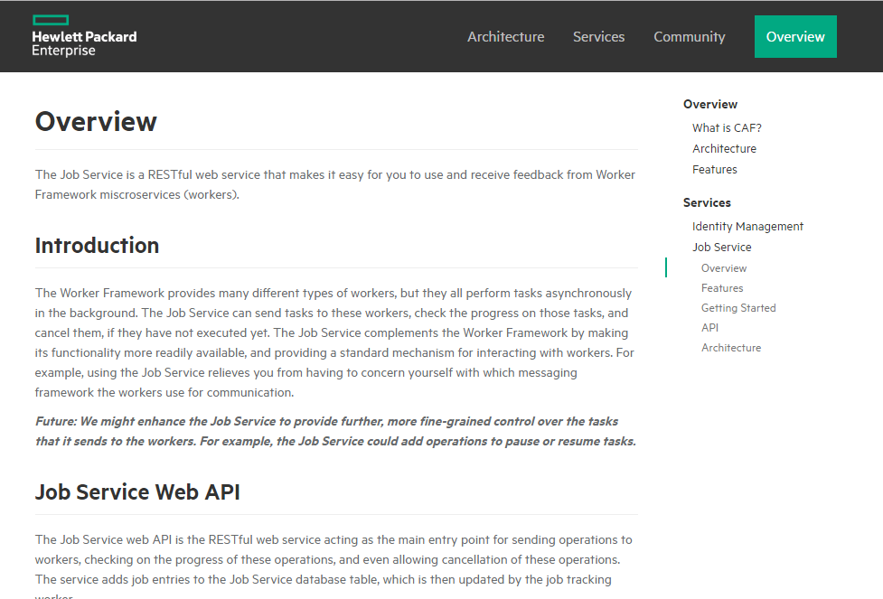
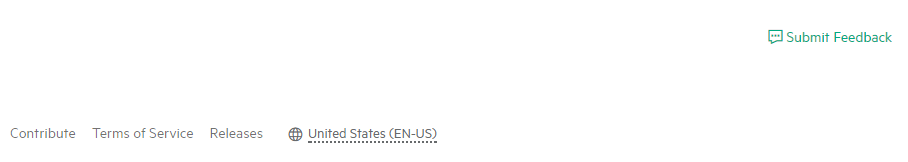

## Navigation

Setting up the navigation for your GitHub page is made easy with JSON files which are used to provide the links in the top navigation, side navigation and footer.

When creating these files it is important that they are stored in the sites `_data` folder. They should also be named accordingly. 

Each file will have a `navigation_items` array which will contain all the required navigation links. 

#### Side Navigation

##### Overview

Side navigation should provide an easy way of exploring services. It is very important to keep it consistent across product features.
Structure for service should have following root topics and corresponding sub topics where relevant:
- Overview
	-	Answer the questions what is it and why would someone use it. 
	-	Highlight any key benefits, as you did in your second sentence above (scales elastically). 
	-	Walk through a use case or scenario. People grasp things much more quickly in example form. It does not have to be much detail, just something of the form, “Suppose you are building an application that does x, you could use the job service to … 
- Features
	-	List and describe the key features (not all features!). Really focus on the differentiators here. 
	-	Illustrate the significance by example. 
- Getting Started
	-	Prerequisites, if any. 
	-	Limitations 
	-	Installation 
	-	Configuration 
	-	Tutorials and/or examples with explanations 
- API
	-	List all of the calls and jump to the reference for that call. 
- Architecture (optional)
	-	Illustrate the overall flow, hierarchy, and relationship of components. 
	-	Include a use case or scenario that demonstrates the architecture.

Any suggested changes (including additional root topics or sub topics) to this structure should be registered as an issue in this GitHub repository.
Please use the following [link](https://github.hpe.com/caf/caf-documentation/issues/new). 

##### Usage

The side navigation on the page is populated with links from the `side_navigation.json` navigation items array. This array contains multiple objects, each with their own preferences, that act as the links.

Each array item must have a `title` and an `icon` and may have either `children` or a `url`. 

The `title` and `url` are localized objects that contain the required translation for each specified language, as described in our [guide to localization](localization.md).

The `icon` variable is only set for navigation items at the top level, i.e. not a child of another navigation item. The icon will appear to the left of the title.

The `children` object is an array of link objects which will also have a `title` and may have either `children` or a `url`. If an item has children they will display below the parent when the parent is clicked. 

*Note: If the `children` object has been defined for a navigation item, then the `url` should not be and vice versa. This is because if a link (parent) has children, it should not navigate to a url when clicked. Rather, it should display the children which may then have a `url` set to navigate to.*

An example of the `side_navigation.json` layout can be seen below:

```json
{
    "navigation_items": [
    {
        "title": {
            "en-us": "Overview",
            "es": "Visión de conjunto",
            "fr": "Aperçu"
        },
        "icon": "hpe-cloud",
        "children": [
        {
            "title": {
                "en-us": "What is CAF?",
                "es": "¿Cuál es la CAF ?",
                "fr": "Qu'est-ce que la CAF ?"
            },
            "url": {
                "en-us": "pages/en-us/what_is_caf",
                "es": "pages/es/what_is_caf",
                "fr": "pages/fr/what_is_caf"
            }
        }, {
            "title": {
                "en-us": "Architecture",
                "es": "Arquitectura",
                "fr": "Architecture"
            },
            "url": {
                "en-us": "pages/en-us/architecture",
                "es": "pages/es/architecture",
                "fr": "pages/fr/architecture"
            }
        }]
    }, {
        "title": {
            "en-us": "Services",
            "es": "Servicios",
            "fr": "Prestations de Service"
        },
        "icon": "hpe-cluster",
        "children": [
        {
            "title": {
                "en-us": "Audit",
                "es": "Auditoría",
                "fr": "Vérification"
            },
            "children": [
            {
                "title": {
                    "en-us": "Overview",
                    "es": "Visión de Conjunto",
                    "fr": "Aperçu"
                },
                "url": {
                    "en-us": "repositories/caf-audit/docs/en-us/overview",
                    "es": "repositories/caf-audit/docs/es/overview",
                    "fr": "repositories/caf-audit/docs/fr/overview"
                }
          	}]
     	}]
     	...
 	}]
}
``` 

In the image below `Overview` is a child of `Job Service`, which is a child of `Services`, has been clicked:



---------------------------------------

#### Top Navigation

The top navigation on the page is populated with links from the `top_navigation.json` navigation items array and is structured very similarly to the `side_navigation.json` file.

Each array item must have a `title`, `url`, `icon` and a `primary` boolean. 

The `title` and `url` are localized objects that contain the required translation for each specified language, as described in our [guide to localization](localization.md).

The `icon` variable is optional and can be set to `""` if you don't wish to use an icon. The icon will appear to the left of the title.

The `primary` boolean describes whether or not the link is the "primary" link. If so, the link will have a greenish background and will stand out more compared to others.

An example of the `top_navigation.json` layout can be seen below:

```json
{
    "navigation_items": [
    {
        "title": {
            "en-us": "Why CAF",
            "es": "¿Por qué la CAF",
            "fr": "Pourquoi CAF"
        },
        "url": {
            "en-us": "",
            "es": "",
            "fr": ""
        },
        "icon": "",
        "primary": false
    }, {
        "title": {
            "en-us": "GitHub",
            "es": "GitHub",
            "fr": "GitHub"
        },
        "url": {
            "en-us": "https://github.hpe.com/caf",
            "es": "https://github.hpe.com/caf",
            "fr": "https://github.hpe.com/caf"
        },
        "icon": "assets/img/github-light.svg",
        "primary": false
    }, {
        "title": {
            "en-us": "Getting Started",
            "es": "Empezando",
            "fr": "Commencer"
        },
        "url": {
            "en-us": "",
            "es": "",
            "fr": ""
        },
        "icon": "",
        "primary": true
    }]
    ...
}
```

The above would result in the following:


---------------------------------------

#### Footer

The footer on the page is populated with links from the `footer_links.json` navigation items array and is also structured very similarly to the `side_navigation.json` file.

Each array item must have a `title` and `url`.

The `title` and `url` are localized objects that contain the required translation for each specified language, as described in our [guide to localization](localization.md).

Inside the `footer_links.json` we have a `feedback_url` attribute as well as the `navigation_items` array. This allows you to set the url for the "Submit Feedback" button which is included with the footer.

An example of the `footer_links.json` layout can be seen below:

```json
{
    "navigation_items": [
    {
        "title": {
            "en-us": "Contribute",
            "es": "Contribuir",
            "fr": "Contribuer"
        },
        "url": {
            "en-us": "pages/en-us/contribute",
            "es": "pages/es/contribuir",
            "fr": "pages/fr/contribuer"
        }
    },
    ...
    ],
    "feedback_url": "https://github.hpe.com/caf/caf-documentation/issues/new"
}
```

The above would result in the following:


