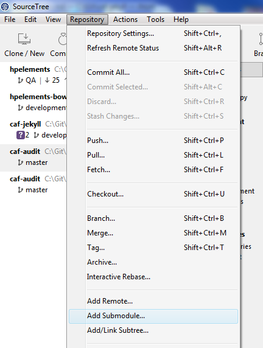
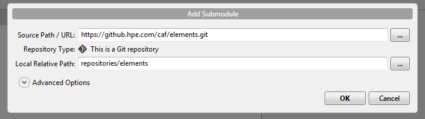
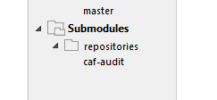
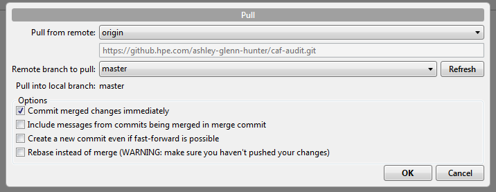
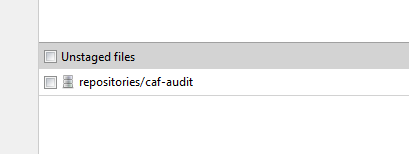

## Using Submodules

Submodules are a key part of how the documentation site is pieced together, so it is important you understand the purpose of them and how they work.

### What are Submodules

Git submodules are designed to be a way to incorporate another project within your project.

Essentially it is a way to take a snapshot of a repository and add this snapshot to your own repository. This does mean that any future changes to that repository will not automatically appear in your repository.

This is very useful when it comes to documentation. The documentation site adds all component repositories as submodules and then has access to all markdown files within that repository.

Due to submodules not updating automatically, this means that developers can work on the documentation without changing the documentation on the live hosted version of the documentation.

Once a release is ready and documentation is in a complete state, the submodule can be updated to point to the latest version of the repository.

### How to add Submodules

This following should be performed in the Documentation repository and all submodules should be added to the `repositories` folder.

***Note: Ensure that the repository is public and the source path uses HTTPS url rather than SSH***

#### Using SourceTree

To add a submodule using SourceTree first clone the documentation repository. Ensure changes are being made on the `gh-pages` branch or they will not update the documentation site.

Select the `Repository` menu and select the `Add Submodule...` option.

Next enter the `Source Path / URL` which will be the url of the repository you want to add, and enter the `Local Relative Path` which should be a sub folder in the `repositories` folder.

Once the submodule has been added push the changes.

#### Using Git Bash

To add a submodule using Git Bash first clone the documentation repository and ensure the current branch is `gh-pages`.

Next we need to add submodule to the it's own sub folder within the `repositories` folder, eg:

    git submodule add https://github.hpe.com/caf/elements.git repositories/elements

Once the submodule has been added push the changes.

### Updating Submodules

When a release is ready you may want to update the submodule so the documentation is updated to show the latest changes or features.

#### Using SourceTree

Expand the submodule folder and double click on the submodule you want to update, eg:

Then pull any changes from master.

Switch back to the Documentation repository and changes to the submodule should show up under `Unstaged Files`.

Stage this change, commit and push. The submodule has then been updated.

#### Using Git Bash

Using Git Bash navigate to the submodule folder eg.

    cd repositories/caf-audit

Checkout the `master` branch:

    git checkout master

Pull the latest changes from master:

    git pull master

Commit the submodule changes:

    git commit -am "Updating caf-audit submodule"

Then push the changes.
