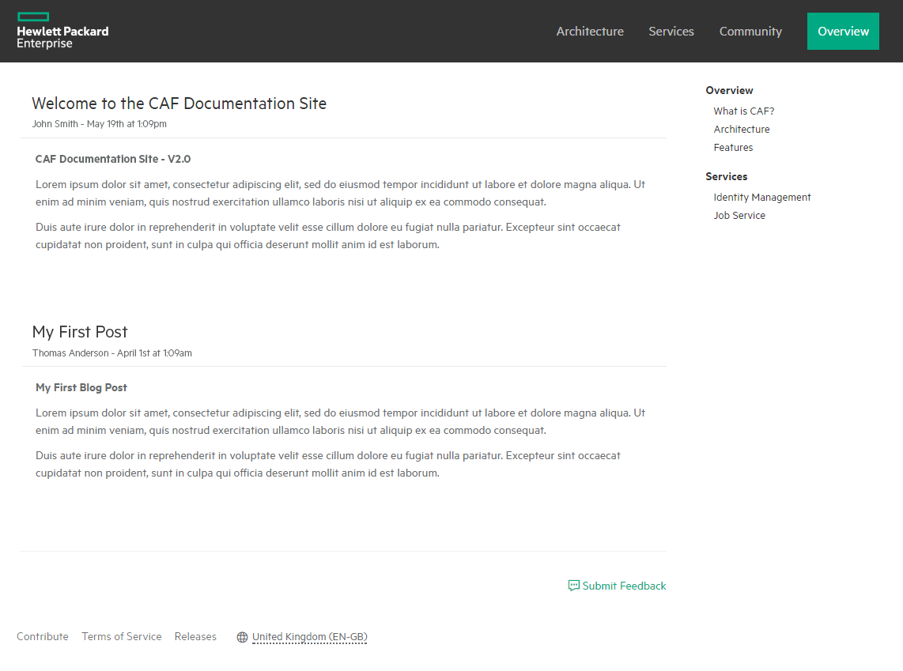

# Using Layouts

Using the layouts we have provided, you can effectively set up the base for your GitHub page with ease.

### Landing Page Layout

When you wish to implement a landing for your GitHub page, you can make use of the `landing` layout provided. 

The landing page had a header section that has a background image, logo, title, slogan and a button. 
The next section contains an overview as well as a short description of the tentpole features.
The third section contains some images of the product in use.
The final section provides links to social sites such as Twitter and GitHub.

To set these attributes, we simply have to set the layout to `landing` and define the other required attributes in the YAML Frontmatter for that page.

This can be seen below:  
```yaml
---
layout: landing

logo: assets/img/caflogo.png
title: Common Application Framework <br><small>from the Big Data group at Hewlett Packard Enterprise</small>
slogan: The Microservices based solution to your Big Data Analytics problems the <br>Common Application Framework accelerates time to value.
button:
    title: Learn More
    url: pages/en-us/what_is_caf

features:
    title: About CAF
    subtitle: Common Application Framework is a platform for building next generation cloud based applications. It provides Identity Management, Storage, Auditing, Job Services, Data Processing and Document Classification services as well as frameworks for creating new services. Developed using Microservices architecture, the Framework utilizes fault-tolerant queues for messaging, Docker containers for packaging and rapid deployment as well as Apache Mesos with Marathon for orchestration and massive scalability.
    feature_list:
        - icon: hpe-expand
          title: Scalable
          subtitle: Lorem ipsum dolor sit amet, consectetur adipiscing elit, sed do eiusmod tempor incididunt ut labore et dolore magna aliqua.
        - icon: hpe-cube
          title: Containerized
          subtitle: Lorem ipsum dolor sit amet, consectetur adipiscing elit, sed do eiusmod tempor incididunt ut labore et dolore magna aliqua.
        - icon: hpe-cloud
          title: Cloud Based
          subtitle: Lorem ipsum dolor sit amet, consectetur adipiscing elit, sed do eiusmod tempor incididunt ut labore et dolore magna aliqua.
        - icon: hpe-shield-configure
          title: Fault Tolerant
          subtitle: Lorem ipsum dolor sit amet, consectetur adipiscing elit, sed do eiusmod tempor incididunt ut labore et dolore magna aliqua.

showcase:
    title: Made with CAF
    subtitle: CAF is being used to develop next generation enterprise applications.
    left_showcase: assets/img/showcase/showcase-2.png
    center_showcase: assets/img/showcase/showcase-1.png
    right_showcase: assets/img/showcase/showcase-3.png

social:
    title: Get Involved
    subtitle: Get involved in the CAF project. Suggest new features, report issues or take part in development.
    social_list:
        - icon: hpe-social-twitter
          title: Twitter
          subtitle: Follow us on Twitter to keep up with the latest news and updates from the CAF team or to get in touch with us!
          link:
            title: '@caf'
            url: http://twitter.com
        - icon: hpe-social-github
          title: GitHub
          subtitle: Fork CAF services on GitHub and submit a pull request to help contribute to the project! Or if you have discovered an issue, report it to us.
          link:
            title: Fork CAF
            url: https://github.hpe.com/caf
        - icon: hpe-chat
          title: Blog
          subtitle: Follow our blog to find out all of the exciting news and announcements regarding CAF.
          link:
            title: Read More Here
            url: pages/blog.html
---
```

The above YAML would result in the following:


---------------------------------------

### API Landing Page Layout

The `api-landing` layout can be used to provide several links to the most important sections of the documentation available at a glance.

The layout is comprised of a header, an optional description or overview and finally several description panels that provide links to other parts of the documentation.
Each panel should contain an icon, a header, a description and a url.

To set these attributes, we simply have to set the layout to `api-landing` and define the other required attributes in the YAML Frontmatter for that page.

This can be seen below:  

```yaml
---
layout: api-landing
title: Getting Started

header: Api & Docs
description: From raw HTTP to helper libraries, get up and running quickly in your language of choice.
links:
    - icon: hpe-alarm
      title: Quickstarts
      description: A set of simple tutorials with code snippets on how to use CAF Audit.
      url: quickstarts
    - icon: hpe-task
      title: Tutorials
      description: Sample applications that cover common use cases in a variety of languages. Download, test drive, and tweet them yourself.
      url: tutorials
    - icon: hpe-code
      title: API Reference
      description: In-depth reference docs for the REST APIs provided by CAF Audit
      url: api
    - icon: hpe-catalog
      title: Helper Libraries
      description: Interact with CAF Audit APIs in Java, Node.js, Ruby, Python, PHP, C#, Javascript and more.
      url: helper-libs
---
```

The above YAML would result in the following:


---------------------------------------

### Default Layout

The `default` layout can be used for pages that contain content solely obtained from a markdown file. For example any pages that simply contain text, images, code samples etc.. should all use the default layout.

To use the default layout add the following to the top of the markdown page:

```yaml
---
layout: default
title: Page Title Here
last_updated: Created and last modified by John Smith on May 1, 2016
---
```
The `title` attribute allow you to specify the page title, and the `last_updated` attribute (optional) allows you to identify when the page was created/last modified.

An example of how a page using this layout might look:


---------------------------------------

### Blog Layout

The `blog` layout can be used to create a *blog* page for your service. This can be useful to provide information about new releases, upcoming versions or other valuable information.

To use the `blog` layout add the following to the top of your markdown file:

```yaml
---
layout: blog

posts:
    - title: Welcome to the CAF Documentation Site
      author: John Smith
      datestamp: May 19th at 1:09pm
      content: posts/caf_site.md
    - title: My First Post
      author: Thomas Anderson
      datestamp: April 1st at 1:09am
      content: posts/first_post.md
---
```

The `posts` attribute should provide an array of post objects. 

Each post object should specify a title, and author, the date/timestamp and the content, which should be the relative path to a plain markdown file containing the contents of the post.
It is recommended that you create a folder to contain all blog post markdown files.

***Note: Posts are displayed in the order they appear in the array.*** 

An example of how a page using this layout might look:



---------------------------------------

### Team Layout

The `team` layout can be used to show the developers currently working on a particular service. 
It can also be used to provide contact details for each member and links to their social sites such as Twitter, GitHub etc..

To use the `team` layout add the following to the top of your markdown file:

```yaml
---
layout: team

header: The Elements Team

team_members:
    - name: Gita Narasimhan
      email: gita.narasimhan@hpe.com
      avatar: /assets/img/user.png
      social:
        - title: Email
          icon: hpe-social-email
          url: mailto:gita.narasimhan@hpe.com

    - name: Alastair Payne
      email: alastair.stu.payne@hpe.com
      avatar: /assets/img/user.png
      social:
        - title: Email
          icon: hpe-social-email
          url: mailto:alastair.stu.payne@hpe.com

    - name: Ashley Hunter
      email: ashley-glenn.hunter@hpe.com
      avatar: /assets/img/user.png
      social:
        - title: Twitter
          icon: hpe-social-twitter
          url: https://twitter.com/ashh640
        - title: GitHub
          icon: hpe-social-github
          url: https://github.com/ashh640
        - title: Email
          icon: hpe-social-email
          url: mailto:ashley-glenn.hunter@hpe.com
---
```

An example of how a page using this layout might look:


---------------------------------------

### Swagger Layout

The `swagger` layout can be used to present APIs in a user friendly way. Swagger definitions can be provided in either `YAML` or `JSON`. The swagger definition should follow the specification [found here](http://swagger.io/specification/).

To use the `swagger` layout set the layout attribute to `swagger`. An addition title attribute can be set to specify the page title.

#### Load YAML/JSON file

The easiest way to display your API is to load a YAML or JSON file containing your Swagger schema from your repository.

To do this simply add the `swagger_url` attribute to the YAML Frontmatter and set it's value to the relative path to the .yaml, .yml or .json file.

And example of this might look like this:

```yaml
---
layout: swagger
title: API
swagger_url: swagger.yaml
---
```

*Note: The url provided must point to a file on the same domain, this cannot be a file loaded from an external site due to browser security restrictions. To allow loading from a different domain you must ensure that the server allows requests from the GitHub pages domain.*

#### Alternate Method - Embedded YAML

An alternative method of specifying a Swagger schema is to simply add the YAML directly to your markdown file within the YAML frontmatter region.

Simply add the Swagger YAML below the layout attribute. This can be seen below:

```yaml
---
layout: swagger
title: API

# Swagger YAML goes here
swagger: "2.0"
info:
  title: "CAF Job Service"
  version: "1.0"
  description: |
    Allows background operations to be sent to the CAF Workers, and for the
    operations to be tracked and controlled.
basePath: /job-service/v1
tags:
  - name: Jobs
    description: Job Control
# ....
---
```

#### Alternate Method - Embedded JSON

A Swagger schema in `JSON` format can also be embedded directly into the markdown file.

The slight difference when using `JSON` is you must specify the `swagger_json` attribute and add the `JSON` as the value of this attribute.

An example can be seen below:

```yaml
---
title: API Json
layout: swagger

# Swagger JSON goes here
swagger_json: {
    "swagger": "2.0",
    "info": {
        "title": "CAF Job Service",
        "version": "1.0",
        "description": "Allows background operations to be sent to the CAF Workers, and for the\noperations to be tracked and controlled."
    },
    "basePath": "/job-service/v1",
    "tags": [
        {
            "name": "Jobs",
            "description": "Job Control"
        }
    ],
    # ....
  }
---
```

#### Swagger 'Try' Functionality

The Swagger layout provides the option to allow a user to try out an API within the browser. The layout will create a form that contains all of the fields for the parameters required and will allow the user to input some sample values and view the response.

The form enforces validation based on whether or not a field is required and also the data type of the field to ensure data is in the correct format.

This functionality is disabled by default. To enabled it simply add the following on to the top of the YAML frontmatter:

```yaml
---
title: API
layout: swagger
swagger_try_enabled: true

swagger: 2.0
# ....
---
```

*Note: A deployed version must be available to use the Swagger Try functionality. Note also that the server the hosts the service must accept cross origin requests from this the GitHub Pages site. For more information  [read here](https://github.com/swagger-api/swagger-editor/blob/master/docs/cors.md).*

Below is an example of how a complete Swagger layout would look like:


