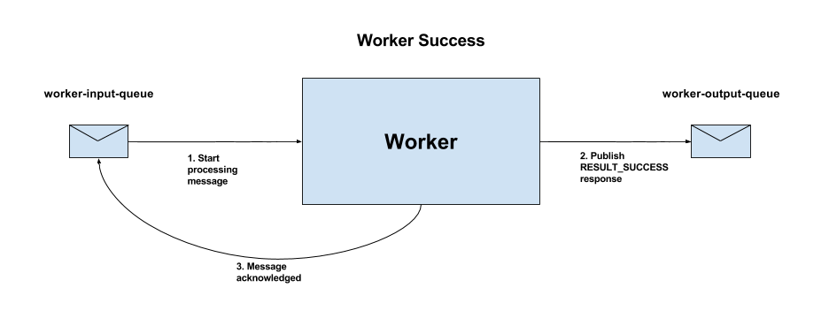
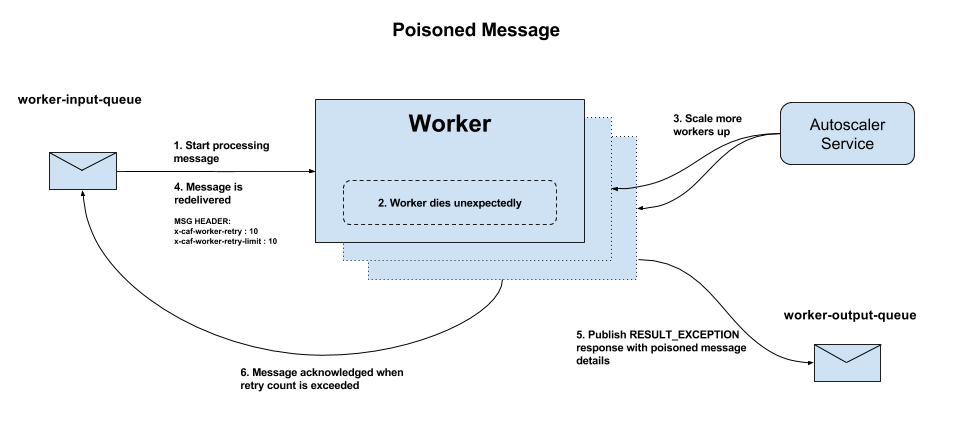
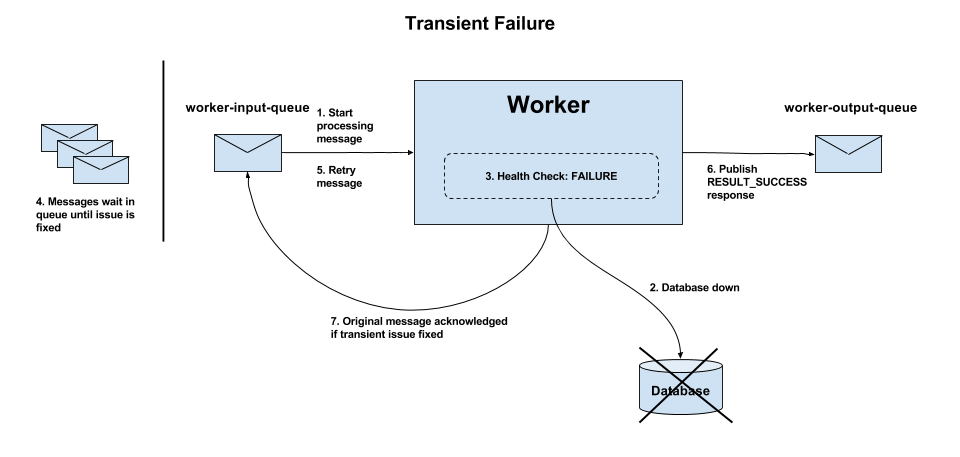

# Error Handling

The purpose of this page is to provide details for the various types of errors and failures that can arise during message processing. A set of rules that every Worker implementation should adhere to is included as well.

## Worker Success
We start though by describing the expected flow when messages are handled by Worker implementations without any issues at all.

*Figure 1 - Message successfully processed by Worker*

1. The Worker receives a message from the messaging input queue, `worker-input-queue` and will start to process it.
2. The message is successfully processed and a `RESULT_SUCCESS` response is published on the messaging output queue, `worker-output-queue` by the worker framework.
3. The original message is then acknowledged.

Some messages however cannot be handled by the Worker and these are described next.

## Poisoned Messages
A poisoned message is a message that a worker is unable to handle. The message is deemed poisonous during processing when repeated catastrophic failure of the worker occurs. Regardless of how many times the message is retried, the worker will not be able to handle the message in a graceful manor. The flow of a poisoned message is described in Figure 2 below:

*Figure 2 - Poisoned message flow*

1. The Worker receives a message from the messaging input queue, `worker-input-queue` and will start to process it.
2. The processing of the message causes the worker to die unexpectedly.
3. The Autoscaler service scales the worker back up again to facilitate a retry.
4. The original message is re-delivered for retry where the `x-caf-worker-retry` message header is stamped on the message and incremented. Messages which cause a worker to crash are retried up to 10 times by default before the worker gives up trying to process them and marks them as poisoned. Note that the number of permitted retries is configurable via the environment variable `CAF_WORKER_RETRY_LIMIT`.
5. When the permitted number of retries is exceeded, a `RESULT_EXCEPTION` response including the poisoned message details is published on the messaging output queue `worker-output-queue` by the worker framework.
6. When the response has been published, the original message is then acknowledged.

## OutOfMemory / StackOverflow Errors
Messages which cause OutOfMemory / StackOverflow errors also cause the Worker to crash. These are treated the same as poisoned messages and will be retried until successful or until the retry count exceeds the permitted number of retries.  If the permitted number of retries is exceeded the message will be placed on the `worker-output-queue` by the framework, with a task status of `RESULT_EXCEPTION`. See Figure 2 above for further details.

## Transient Failures
Transient errors arise as a result of a failure beyond the control of the Worker, e.g the database being down or unavailable.

*Figure 3 - Transient failure flow*

1. The Worker receives a message from the messaging input queue, `worker-input-queue` and will start to process it.
2. The Worker is unable to process the message (unexpectedly due to some failure outside of its control - e.g. database down).
3. The failure is reported as transient causing the Worker to be flagged as unhealthy.
4. The Worker stops accepting work and messages intended for it are queued up within the messaging system. Messages will continue to be queued until the transient issue is addressed.
5. When the health-check starts passing again, the Worker will retry the message. It will continue to retry the message indefinitely until the transient error is resolved.
6. If the transient error is resolved, a `RESULT_SUCCESS` response is placed on the messaging output queue `worker-output-queue` by the worker framework.
7. If the transient error is resolved, the original message is then acknowledged.
 
## InvalidTaskException
An InvalidTaskException is thrown when the input message is not parsable. This exception type does not cause the Worker to crash. The message is never re-tried. Instead, an `INVALID_TASK` response with error details is placed on the messaging output queue `worker-output-queue` by the worker framework.

## RuntimeException
A RuntimeException can be detected by the Worker as a result of some fault in the Worker logic (e.g. NullPointerException). The Worker will not crash as a result of this kind of error but the original message will never be retried.

*Figure 4 - RuntimeException flow*

1. The Worker receives a message from the messaging input queue, `worker-input-queue` and will start to process it.
2. A runtime exception is detected by the Worker.
3. A `RESULT_EXCEPTION` response with exception details is placed on the messaging output queue `worker-output-queue` by the worker framework.
4. The original message is never retried but instead acknowledged.

## Error Handling Rules
The general following rules should be adhered to by all Worker implementations:

 - For any explicit failures, return a failure result, not an exception
 - If the input message is not parsable, throw an InvalidTaskException
 - If the task cannot be accepted right now, throw a TaskRejectedException
 - If a transient error occurs in processing, throw a TaskRejectedException
 - If the worker receives an InterruptedException, propagate the InterruptedException
 - If a catastrophic error occurs in processing, throw TaskFailedException

 The `WorkerFactory` should identify whether the task message data is
 parsable and this is the first opportunity to throw an `InvalidTaskException`.
 Once a Worker is created with a task object, the framework will verify the
 object's constraints (if there are any), which is the second chance to throw
 `InvalidTaskException`. The constructor of the `Worker` can throw an
 `InvalidTaskException`. Finally a worker's `doWork()` method can thow an
 `InvalidTaskException`.

 While `InvalidTaskException` is a non-retryable case, there may be retryable
 scenarios for instance a brief disconnection from a temporary resources such as
 a database. If you have a health check in your `WorkerFactory` and this is
 currently failing, you may wish to throw `TaskRejectedException`, which will
 push the task back onto the queue. Once inside a Worker itself, either the
 code or the libraries used should be able to tolerate some amount of transient
 failures in connected resources, but if this still cannot be rectified in a
 reasonable time frame then it is also valid to throw `TaskRejectedException` from
 inside the Worker, with the understanding that any amount of work done so
 far will be abandoned.

 You do not need to handle the following, as the framework will handle it:

 - The input wrapper not being parsable
 - Connections to the queue dropping
