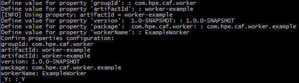

# Getting Started

## Prerequisites

- Internet connection
- Maven
- Docker VM
- IntelliJ (Optional)
- NetBeans (Optional)

## Using the Worker Archetypes

A Maven Archetype is a template for which you can base a project on.

Excerpt from [Apache Maven Archetype Introduction](https://maven.apache.org/guides/introduction/introduction-to-archetypes.html) :

<pre>"Archetype is a Maven project templating toolkit.
An archetype is defined as an original pattern or model from which all other things of the same kind are made."</pre>

### Maven Archetypes for Worker projects

You can create the foundations of a new Worker project by using the `worker-archetype` module.

The Example Worker project was used to base the Worker Archetype project upon and so the generation of a new project from the Worker Archetype will contain the same functionality as the Example Worker.

It performs a text conversion on a text file based on an `Action` enumeration passed in from the `ExampleWorkerTask` class. It retrieves the text from a data source and returns a result message containing either a reference to the result in the `DataStore` or the result itself.

### Creating a new Worker from Worker Archetypes

A new worker aggregator project generated from the Worker Archetype has a set of properties that are shared between its submodules:

- ArtifactID
- GroupID
- Version
- Package
- WorkerName

The following subsections provide instructions on how you can use Maven Command Line Interface (CLI), IntelliJ Integrated Development Environment (IDE) or NetBeans IDE to create the components of a Worker from the Worker Archetype.

#### Maven CLI

The Maven CLI offers developers the ability to generate projects from archetypes with the `mvn archetype:generate` command. The location where you run the command is where the projects are created.

##### Generate the New Worker's Aggregator

Generate the new Worker's Aggregator from the `worker-archetype` with the following Maven command:

<pre>mvn archetype:generate -DarchetypeGroupId=com.github.workerframework -DarchetypeArtifactId=worker-archetype</pre>

The CLI will prompt you for artifactId, groupId, version (default suggestion is 1.0.0-SNAPSHOT), package (default suggestion is the groupId, you should however adjust this to include the worker's purpose) and workerName properties required for the new worker project. See Figure 1.

*Figure 1*

If you are satisfied with the properties you have set, confirm these by typing 'Y' else if you are not satisfied type 'N' or any other character to re-enter property values. After confirming your properties Maven will generate the new Worker Aggregator project which will contain the following submodules:

- `<artifactId>-shared` - submodule containing the Worker's interfaces.
- `<artifactId>` - submodule containing the Worker's backend code.
- `<artifactId>-container` - submodule containing the Worker's container and testing configurations.
- `<artifactId>-testing` - submodule containing the Worker's acceptance integration testing classes.

#### IntelliJ IDE

IntelliJ offers the ability to generate projects from archetypes via its GUI.

##### Generate the New Worker's Aggregator

Generate the new Worker's Aggregator from the `worker-archetype` by following these instructions:

- 'File > New > Project...'
- Select Maven from the left-hand pane > Tick 'Create from archetype' > Click 'Add Archetype...'
- Specify the details of the 'worker-archetype'
	- GroupId : com.github.workerframework
	- ArtifactId : worker-archetype
	- Version : 1.8.0-249
	- Click 'OK'
- Select the added 'com.github.workerframework:worker-archetype' archetype > Click 'Next'
- Enter GroupId, ArtifactId and Version of your Worker project > Click 'Next', e.g:
	- GroupId : <groupId>
	- ArtifactId : <artifactId>
	- Version : 1.0.0-SNAPSHOT
- Add each of the following properties (Alt+Insert) and replace the example values with your project specific values > Click 'Next':
	- package : com.hpe.caf.worker.example
	- workerName : ExampleWorker
- Name the Project after its ArtifactId and specify the location of the project > Click 'Finish', e.g:
	- Project name : <artifactId>
	- Project location : C:\MyWorkerProjects\<artifactId>

The foundations for your new Worker is now set up. The generated project will contain the following submodules:

- `<artifactId>-shared` - submodule containing the Worker's interfaces.
- `<artifactId>` - submodule containing the Worker's backend code.
- `<artifactId>-container` - submodule containing the Worker's container and testing configurations.
- `<artifactId>-testing` - submodule containing the Worker's acceptance integration testing classes.

#### NetBeans IDE

NetBeans offers developers the ability to generate projects from archetypes via its GUI.

##### Generate the New Worker's Aggregator

Generate the new Worker's Aggregator from the `worker-archetype` by following these instructions:

- 'File > New Project...'
- From the Categories Pane select Maven > From the Select Pane select 'Project from Archetype' > Click 'Next >'
- Specify the details of the 'worker-archetype'
	- GroupId : com.github.workerframework
	- ArtifactId : worker-archetype
	- Version : 1.8.0-249
	- Click 'Next >'
- Enter Project Name, Project Location, GroupId, Version and Package of your Worker Shared project, e.g:
	- Project Name : <artifactId>
	- Project Location : C:\MyWorkerProjects
	- GroupId : <groupId>
	- Version : 1.0.0-SNAPSHOT
	- Package : com.hpe.caf.worker.example
- Set workerName property > Click 'Finish', e.g:
	- workerName : ExampleWorker

The foundations for your new Worker is now set up. The generated project will contain the following submodules:

- `<artifactId>-shared` - submodule containing the Worker's interfaces.
- `<artifactId>` - submodule containing the Worker's backend code.
- `<artifactId>-container` - submodule containing the Worker's container and testing configurations.
- `<artifactId>-testing` - submodule containing the Worker's acceptance integration testing classes.

## Further Information

At the time this guide was written with:

- Apache Maven 3.3.3
- NetBeans 8.1
- IntelliJ 15
