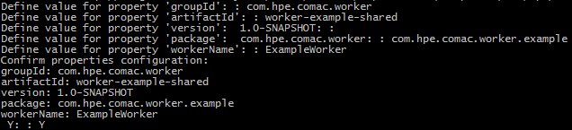
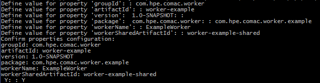
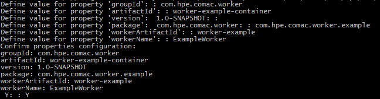

# Creating a Worker

## Prerequisites

- Connection to Cambridge Maven Nexus [http://cmbg-maven.autonomy.com/nexus/](http://cmbg-maven.autonomy.com/nexus/) 
	- If you do not have DNS resolution to Cambridge Maven Nexus you may be able to use the direct IP [http://16.26.25.50/nexus/](http://16.26.25.50/nexus/) in place of [http://cmbg-maven.autonomy.com/nexus/](http://cmbg-maven.autonomy.com/nexus/)
- Maven
- Docker VM
- IntelliJ (Optional)
- NetBeans (Optional)

## Introduction

Stateless Workers are microservices that can be scaled up or down to meet demand. In essence, a Worker should not be aware (or need to be aware) of any other Worker or its surrounding system. This way additional "clones" of a Worker can be created or destroyed at will to provide scaling without affecting other Workers.

### Components of a Worker

The following modules are required to create a worker. Each contains its own pom.xml with its own dependencies and plugins:

- `worker-example-shared` module contains objects shared between the worker and consumers. It forms an interface to the worker.
	1. **ExampleWorkerResult** – the result from the worker. Results are serialized and sent to the RabbitMQ queue specified in the rabbit configuration.
	2. **ExampleWorkerTask** – the main point of entry to communicate with the worker. Tasks are serialized and sent to the worker via the configured queue on RabbitMQ.
	3. **ExampleWorkerStatus** – records the status of the worker result.
	4. **ExampleWorkerConstants** - public constant variables.
- `worker-example` module contains the worker itself, closely related classes and an md documentation explaining the service use of the worker.
	1. **ExampleWorker** – responsible for doing the work. AbstractWorker is the preferable base class for a worker in most scenarios.
	2. **ExampleWorkerConfiguration** – holds configuration parameters for execution of the worker. These are read in from an ExampleWorkerConfiguration json file and used within the worker execution.
	3. **ExampleWorkerFactory** – creates a worker, extends AbstractWorkerFactory.
	4. **ExampleWorkerFactoryProvider** - creates a worker factory, extends WorkerFactoryProvider.
	5. **ExampleWorkerHealthCheck** - provides a basic health check for marathon GUI display, implements HealthReporter.
- `worker-example-container` module purpose is to build the docker image for the worker. It has two submodules named build and test. The **build** module is responsible for building the docker image of the worker and pushing the image to docker. The **test** module is responsible for starting a container for RabbitMQ, test-configs and the worker, and running the integration tests. These tests runs locally and sends task messages to the worker via RabbitMQ. It waits for a response from the worker which will be published by the worker and retrieved from the configured queue.
	1. **build**
		1. **pom.xml** - specifying the docker maven plugin and configurations to build the image for the worker
	2. **test**
		1. **pom.xml** - specifying maven compiler and failsafe plugin for compiling and running integration tests, docker maven plugin to run containers for RabbitMQ, the test-configs and the worker.
		2. **ExampleWorkerResultPreparationProvider** – for creating test items, extends PreparationItemProvider or some subclass of ContentFilesTestItemProvider.
		3. **ExampleWorkerTestControllerProvider** – provides various providers and processors, extends AbstractTestControllerProvider.
		4. **ExampleWorkerTestExpectation** – test item expected output for comparison with actual output, extends ContentFileTestExpectation.
		5. **ExampleWorkerTestInput** – test item input, extends FileTestInputData.
		6. **ExampleWorkerResultValidationProcessor** – for validating the expected result and returned worker result are the same/as expected, extends AbstractResultProcessor or one of its subclasses.
		7. **ExampleWorkerSaveResultProcessor** – for generating test data, extends ContentResultProcessor or a subclass of PreparationResultProcessor.
		8. **ExampleWorkerTaskFactory** – for creating tasks, extends FileInputWorkerTaskFactory.

## Using the Worker Archetypes

A Maven Archetype is a template for which you can base a project on.

Excerpt from [Apache Maven Archetype Introduction](https://maven.apache.org/guides/introduction/introduction-to-archetypes.html) :

<pre>"Archetype is a Maven project templating toolkit.
An archetype is defined as an original pattern or model from which all other things of the same kind are made."</pre>

### Maven Archetypes for Worker projects

You can create the foundations of a new Worker project by using the available Worker Archetypes:

- `worker-shared-archetype`
- `worker-archetype`
- `worker-container-archetype`

The Example Worker projects were used to base these Worker Archetype projects upon and so the generation of a new project from these Worker Archetypes will contain the same functionalities as the Example Worker.

It performs a text conversion on a text file based on an `Action` enumeration passed in from the `ExampleWorkerTask` class. It retrieves the text from a data source and returns a result message containing either a reference to the result in the `DataStore` or the result itself.

### Creating a new Worker from Worker Archetypes

A new worker will have a common module properties that they share between each other:

- GroupID
- Version
- Package
- WorkerName

The following subsections provide instructions on how you can use Maven Command Line Interface (CLI), IntelliJ Integrated Development Environment (IDE) or NetBeans IDE to create the components of a Worker from Worker Archetypes.

#### Maven CLI

The Maven CLI offers developers the ability to generate projects from archetypes with the `mvn archetype:generate` command. The location where you run the command will be the where the projects are created.

##### 1. Generate the New Worker's Shared Module

Generate the new Worker's Shared module from the `worker-shared-archetype` with the following Maven command:

<pre>mvn archetype:generate -DarchetypeRepository=http://cmbg-maven.autonomy.com/nexus/content/repositories/snapshots -DarchetypeVersion=1.1-SNAPSHOT -DarchetypeArtifactId=worker-shared-archetype -DarchetypeGroupId=com.hpe.caf.worker</pre>

The CLI will prompt you for groupId, version (default suggestion is 1.0-SNAPSHOT), package (default suggestion is the groupId, you should however adjust this to include the worker's purpose) and workerName properties required for the new shared project. The artifactId should be distinct to this module's purpose. See Figure 1.

*Figure 1*

If you are satisfied with the properties you have set, confirm these by typing 'Y' else if you are not satisfied type 'N' or any other character to re-enter property values. After confirming your properties Maven will generate the new Worker's Shared module. Take note of these property names for the generation of the Worker Back-end module.

##### 2. Generate the New Worker's Back-end Module

Generate the new Worker's Back-end project from the `worker-archetype` with the following Maven command:

<pre>mvn archetype:generate -DarchetypeRepository=http://cmbg-maven.autonomy.com/nexus/content/repositories/snapshots -DarchetypeVersion=1.1-SNAPSHOT -DarchetypeArtifactId=worker-archetype -DarchetypeGroupId=com.hpe.caf.worker</pre>

The CLI will prompt you for the Worker's common properties; groupId, version (default suggestion is 1.0-SNAPSHOT), package (default suggestion is the groupId, you should however adjust this to the package property value you set in the shared module) and workerName. The artifactId should be distinct to this module's purpose. In addition the Back-end module archetype will prompt you for the name of the Worker Shared module's artifactId property that you set in the previous step. See Figure 2.

*Figure 2*

If you are satisfied with the properties you have set, confirm these by typing 'Y' else if you are not satisfied type 'N' or any other character to re-enter property values. After confirming your properties Maven will generate the new Worker's Back-end module. Take note of these property names for the generation of the Worker Container module.

##### 3. Generate the New Worker's Container Module

Generate the new Worker's Container project from the `worker-container-archetype` with the following Maven command:

<pre>mvn archetype:generate -DarchetypeRepository=http://cmbg-maven.autonomy.com/nexus/content/repositories/snapshots -DarchetypeVersion=1.1-SNAPSHOT -DarchetypeArtifactId=worker-container-archetype -DarchetypeGroupId=com.hpe.caf.worker</pre>

The CLI will prompt you for the Worker's common properties; groupId, version (default suggestion is 1.0-SNAPSHOT), package (default suggestion is the groupId, you should however adjust this to the package property value you set in the shared module) and workerName. The artifactId should be distinct to this module's purpose. In addition the Container module archetype will prompt you for the name of the Worker Back-end module's artifactId property that you set in the previous step. See Figure 3.

*Figure 3*

If you are satisfied with the properties you have set, confirm these by typing 'Y' else if you are not satisfied type 'N' or any other character to re-enter property values. After confirming your properties Maven will generate the new Worker's Container module.

Due to a bug with the Apache Maven Archetype, file name some place-holders that are preceded with underscores do not get replaced and so as a manual step it is required that you replace these manually. The generated container project .../configuration/marathon-template-config and .../test-configs folders contain container configuration files that contain left over place-holders within their file names. Replace all occurrences of `__workerArtifactId__` with the name of the Worker Back-end module's artifactId property (workerArtifactId). See the **Renaming Container Marathon Configuration Files** and **Renaming Container Test Configuration Files** table in the Appendix.

#### IntelliJ IDE

IntelliJ offers developers the ability to generate projects from archetypes via its GUI.

##### 1. Generate the New Worker's Shared Module

Generate the new Worker's Shared module from the `worker-shared-archetype` by following these instructions:

- 'File > New > Project...'
- Select Maven from the left-hand pane > Tick 'Create from archetype' > Click 'Add Archetype...'
- Specify the details of the 'worker-shared-archetype'
	- GroupId : com.hpe.caf.worker
	- ArtifactId : worker-shared-archetype
	- Version : 1.1-SNAPSHOT
	- Repository : http://cmbg-maven.autonomy.com/nexus/content/repositories/snapshots
	- Click 'OK'
- Select the added 'com.hpe.caf.worker:worker-shared-archetype' archetype > Click 'Next'
- Enter GroupId, ArtifactId and Version of your Worker Shared project > Click 'Next', e.g:
	- GroupId : com.hpe.comac.worker
	- ArtifactId : worker-example-shared
	- Version : 1.0-SNAPSHOT
- Add each of the following properties (Alt+Insert) and replace the example values with your project specific values > Click 'Next':
	- package : com.hpe.comac.worker.example
	- workerName : ExampleWorker
- Name the Project after its ArtifactId and specify the location of the project > Click 'Finish', e.g:
	- Project name : worker-example-shared
	- Project location : C:\MyWorkerProjects\

The foundation for your new Worker's Shared module is now set up.

##### 2. Generate the New Worker's Back-end Module

Generate the new Worker's Back-end module from the `worker-archetype` by following these instructions:

- 'File > New > Project...'
- Select Maven from the left-hand pane > Tick 'Create from archetype' > Click 'Add Archetype...'
- Specify the details of the 'worker-archetype'
	- GroupId : com.hpe.caf.worker
	- ArtifactId : worker-archetype
	- Version : 1.1-SNAPSHOT
	- Repository : http://cmbg-maven.autonomy.com/nexus/content/repositories/snapshots
	- Click 'OK'
- Select the added 'com.hpe.caf.worker:worker-archetype' archetype > Click 'Next'
- Enter GroupId, ArtifactId and Version of your Worker Back-end project > Click 'Next', e.g:
	- GroupId : com.hpe.comac.worker
	- ArtifactId : worker-example
	- Version : 1.0-SNAPSHOT
- Add each of the following properties (Alt+Insert) and replace the example values with your project specific values > Click 'Next':
	- package : com.hpe.comac.worker.example
	- workerName : ExampleWorker
	- workerSharedArtifactId : worker-example-shared
		- This is the name of the Worker Shared module's artifactId property.
- Name the Project after its ArtifactId and specify the location of the project > Click 'Finish', e.g:
	- Project name : worker-example
	- Project location : C:\MyWorkerProjects\

The foundation for your new Worker's Back-end module is now set up.

##### 3. Generate the New Worker's Container Module

Generate the new Worker's Container module from the `worker-container-archetype` by following these instructions:

- 'File > New > Project...'
- Select Maven from the left-hand pane > Tick 'Create from archetype' > Click 'Add Archetype...'
- Specify the details of the 'worker-container-archetype'
	- GroupId : com.hpe.caf.worker
	- ArtifactId : worker-container-archetype
	- Version : 1.1-SNAPSHOT
	- Repository : http://cmbg-maven.autonomy.com/nexus/content/repositories/snapshots
	- Click 'OK'
- Select the added 'com.hpe.caf.worker:worker-container-archetype' archetype > Click 'Next'
- Enter GroupId, ArtifactId and Version of your Worker Container project > Click 'Next', e.g:
	- GroupId : com.hpe.comac.worker
	- ArtifactId : worker-example-container
	- Version : 1.0-SNAPSHOT
- Add each of the following properties (Alt+Insert) and replace the example values with your project specific values > Click 'Next':
	- package : com.hpe.comac.worker.example
	- workerName : ExampleWorker
	- workerArtifactId : worker-example
		- This is the name of the Worker Back-end module's artifactId property.
- Name the Project after its ArtifactId and specify the location of the project > Click 'Finish', e.g:
	- Project name : worker-example-container
	- Project location : C:\MyWorkerProjects\

Due to a bug with the Apache Maven Archetype, file name some place-holders that are preceded with underscores do not get replaced and so as a manual step it is required that you replace these manually. The generated container project .../configuration/marathon-template-config and .../test-configs folders contain container configuration files that contain left over place-holders within their file names. Replace all occurrences of `__workerArtifactId__` with the name of the Worker Back-end module's artifactId property (workerArtifactId). See the **Renaming Container Marathon Configuration Files** and **Renaming Container Test Configuration Files** table in the Appendix.

#### NetBeans IDE

NetBeans offers developers the ability to generate projects from archetypes via its GUI.

##### 1. Generate the New Worker's Shared Module

Generate the new Worker's Shared module from the `worker-shared-archetype` by following these instructions:

- 'File > New Project...'
- From the Categories Pane select Maven > From the Select Pane select 'Project from Archetype' > Click 'Next >'
- Specify the details of the 'worker-shared-archetype'
	- GroupId : com.hpe.caf.worker
	- ArtifactId : worker-shared-archetype
	- Version : 1.1-SNAPSHOT
	- Repository : http://cmbg-maven.autonomy.com/nexus/content/repositories/snapshots
	- Click 'Next >'
- Enter Project Name, Project Location, GroupId, Version and Package of your Worker Shared project, e.g:
	- Project Name : worker-example-shared
	- Project Location : C:\MyWorkerProjects
	- GroupId : com.hpe.comac.worker
	- Version : 1.0-SNAPSHOT
	- Package : com.hpe.comac.worker.example
- Set workerName property > Click 'Finish', e.g:
	- workerName : ExampleWorker

The foundation for your new Worker's Shared module is now set up.

##### 2. Generate the New Worker's Back-end Module

Generate the new Worker's Back-end module from the `worker-archetype` by following these instructions:

- 'File > New Project...'
- From the Categories Pane select Maven > From the Select Pane select 'Project from Archetype' > Click 'Next >'
- Specify the details of the 'worker-shared-archetype'
	- GroupId : com.hpe.caf.worker
	- ArtifactId : worker-archetype
	- Version : 1.1-SNAPSHOT
	- Repository : http://cmbg-maven.autonomy.com/nexus/content/repositories/snapshots
	- Click 'Next >'
- Enter Project Name, Project Location, GroupId, Version and Package of your Worker Shared project, e.g:
	- Project Name : worker-example
	- Project Location : C:\MyWorkerProjects
	- GroupId : com.hpe.comac.worker
	- Version : 1.0-SNAPSHOT
	- Package : com.hpe.comac.worker.example
- Set workerName and workerSharedArtifactId properties > Click 'Finish', e.g:
	- workerName : ExampleWorker
	- workerSharedArtifactId : worker-example-shared
		- This is the name of the Worker Shared module's artifactId property.

The foundation for your new Worker's Back-end module is now set up.

##### 3. Generate the New Worker's Container Module

Generate the new Worker's Back-end module from the `worker-archetype` by following these instructions:

- 'File > New Project...'
- From the Categories Pane select Maven > From the Select Pane select 'Project from Archetype' > Click 'Next >'
- Specify the details of the 'worker-container-archetype'
	- GroupId : com.hpe.caf.worker
	- ArtifactId : worker-container-archetype
	- Version : 1.1-SNAPSHOT
	- Repository : http://cmbg-maven.autonomy.com/nexus/content/repositories/snapshots
	- Click 'Next >'
- Enter Project Name, Project Location, GroupId, Version and Package of your Worker Shared project, e.g:
	- Project Name : worker-example-container
	- Project Location : C:\MyWorkerProjects
	- GroupId : com.hpe.comac.worker
	- Version : 1.0-SNAPSHOT
	- Package : com.hpe.comac.worker.example
- Set workerName and workerArtifactId properties > Click 'Finish', e.g:
	- workerName : ExampleWorker
	- workerArtifactId : worker-example
		- This is the name of the Worker Back-end module's artifactId property.

Due to a bug with the Apache Maven Archetype, file name some place-holders that are preceded with underscores do not get replaced and so as a manual step it is required that you replace these manually. The generated container project .../configuration/marathon-template-config and .../test-configs folders contain container configuration files that contain left over place-holders within their file names. Replace all occurrences of `__workerArtifactId__` with the name of the Worker Back-end module's artifactId property (workerArtifactId). See the **Renaming Container Marathon Configuration Files** and **Renaming Container Test Configuration Files** table in the Appendix.

# Appendix

<table>
<thead>
<tr>
  <th>Renaming Container Marathon Configuration Files</th>
</tr>
</thead>
<tbody>
<tr>
  <td>Before</td>
  <td>After</td>
</tr>
<tr>
  <td>cfg_${marathon-group}___workerArtifactId___ExampleWorkerConfiguration</td>
  <td>cfg_${marathon-group}_worker-example_ExampleWorkerConfiguration</td>
</tr>
<tr>
  <td>cfg_${marathon-group}___workerArtifactId___FileSystemDataStoreConfiguration</td>
  <td>cfg_${marathon-group}_worker-example_FileSystemDataStoreConfiguration</td>
</tr>
<tr>
  <td>cfg_${marathon-group}___workerArtifactId___RabbitWorkerQueueConfiguration</td>
  <td>cfg_${marathon-group}_worker-example_RabbitWorkerQueueConfiguration</td>
</tr>
<tr>
  <td>cfg_${marathon-group}___workerArtifactId___StorageServiceDataStoreConfiguration</td>
  <td>cfg_${marathon-group}_worker-example_StorageServiceDataStoreConfiguration</td>
</tr>
</tbody>
</table>

<table>
<thead>
<tr>
  <th>Renaming Container Test Configuration Files</th>
</tr>
</thead>
<tbody>
<tr>
  <td>Before</td>
  <td>After</td>
</tr>
<tr>
  <td>cfg_test___workerArtifactId___ExampleWorkerConfiguration</td>
  <td>cfg_test_worker-example_ExampleWorkerConfiguration</td>
</tr>
<tr>
  <td>cfg_test___workerArtifactId___FileSystemDataStoreConfiguration</td>
  <td>cfg_test_worker-example_FileSystemDataStoreConfiguration</td>
</tr>
<tr>
  <td>cfg_test___workerArtifactId___RabbitConfiguration</td>
  <td>cfg_test_worker-example_RabbitConfiguration</td>
</tr>
<tr>
  <td>cfg_test___workerArtifactId___RabbitWorkerQueueConfiguration</td>
  <td>cfg_test_worker-example_RabbitWorkerQueueConfiguration</td>
</tr>
<tr>
  <td>cfg_test___workerArtifactId___StorageServiceDataStoreConfiguration</td>
  <td>cfg_test_worker-example_StorageServiceDataStoreConfiguration</td>
</tr>
</tbody>
</table>

At the time this guide was written with:

- Apache Maven 3.3.3
- NetBeans 8.1
- IntelliJ 15