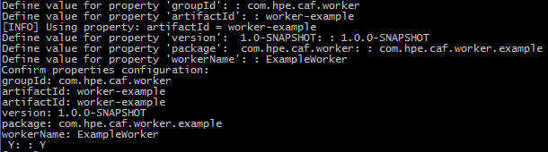

# Creating a Worker

## Prerequisites

- Internet connection
    - Connectivity OSS Sonatype [https://oss.sonatype.org/content/repositories/](https://oss.sonatype.org/content/repositories/) 
- Maven
- Docker VM
- IntelliJ (Optional)
- NetBeans (Optional)

## Introduction

Stateless Workers are microservices that can be scaled up or down to meet demand. In essence, a Worker should not be aware (or need to be aware) of any other Worker or its surrounding system. This way additional "clones" of a Worker can be created or destroyed at will to provide scaling without affecting other Workers.

### Components of a Worker

The following modules are required to create a worker. Each contains its own pom.xml with its own dependencies and plugins:

- `worker-example-shared` module contains objects shared between the worker and consumers. It forms an interface to the worker.
	1. **ExampleWorkerResult** – the result from the worker. Results are serialized and sent to the RabbitMQ queue specified in the rabbit configuration.
	2. **ExampleWorkerTask** – the main point of entry to communicate with the worker. Tasks are serialized and sent to the worker via the configured queue on RabbitMQ.
	3. **ExampleWorkerStatus** – records the status of the worker result.
	4. **ExampleWorkerConstants** – public constant variables.
	5. **ExampleWorkerAction** – enumeration specifying which processing action to be taken in the worker.
- `worker-example` module contains the worker itself, closely related classes and an md documentation explaining the service use of the worker.
	1. **ExampleWorker** – responsible for doing the work. AbstractWorker is the preferable base class for a worker in most scenarios.
	2. **ExampleWorkerConfiguration** – holds configuration parameters for execution of the worker. These are read in from an ExampleWorkerConfiguration json file and used within the worker execution.
	3. **ExampleWorkerFactory** – creates a worker, extends AbstractWorkerFactory.
	4. **ExampleWorkerFactoryProvider** – creates a worker factory, extends WorkerFactoryProvider.
	5. **ExampleWorkerHealthCheck** – provides a basic health check for marathon GUI display, implements HealthReporter.
- `worker-example-container` module is for building the Docker image of the worker and pushing the image to Docker. The module starts a container for RabbitMQ, test-configs, the worker and runs the worker acceptance integration testcases via the `worker-example-testing` module.
	1. **ExampleWorkerAcceptanceIT** – calls the `worker-example-testing` module's ExampleWorkerTestControllerProvider class to generate or run worker integration testing testcase files.
	2. **pom.xml** – specifies the Docker Maven plugin configurations to build the image for the worker, and Maven compiler and failsafe plugin for compiling and running integration tests.
- `worker-example-testing` module is responsible for generating or running worker testcase files. In generation mode it sends a task message for each input source file to the worker via RabbitMQ and on retrieval of source file response message(s) it creates testcases. In run-testcases mode it sends a task message for each testcase's source file to the worker via RabbitMQ and on retrieval of a source file's response message(s) it validates the expected content contained within the testcase file against the actual content returned in the worker's response.
	1. **pom.xml** – specifying maven compiler and failsafe plugin for compiling and running integration tests, Docker maven plugin to run containers for RabbitMQ, the test-configs and the worker.
	2. **ExampleWorkerResultPreparationProvider** – for creating test items, extends PreparationItemProvider or some subclass of ContentFilesTestItemProvider.
	3. **ExampleWorkerTestControllerProvider** – provides various providers and processors, extends AbstractTestControllerProvider.
	4. **ExampleWorkerTestExpectation** – test item expected output for comparison with actual output, extends ContentFileTestExpectation.
	5. **ExampleWorkerTestInput** – test item input, extends FileTestInputData.
	6. **ExampleWorkerResultValidationProcessor** – for validating the expected result and returned worker result are the same/as expected, extends AbstractResultProcessor or one of its subclasses.
	7. **ExampleWorkerSaveResultProcessor** – for generating test data, extends ContentResultProcessor or a subclass of PreparationResultProcessor.
	8. **ExampleWorkerTaskFactory** – for creating tasks, extends FileInputWorkerTaskFactory.
	9. **ExampleWorkerResultAccessors** – for accessing ExampleWorkerResult fields.

## Using the Worker Archetype

A Maven Archetype is a template for which you can base a project on.

Excerpt from [Apache Maven Archetype Introduction](https://maven.apache.org/guides/introduction/introduction-to-archetypes.html) :

<pre>"Archetype is a Maven project templating toolkit.
An archetype is defined as an original pattern or model from which all other things of the same kind are made."</pre>

### Maven Archetype for Worker projects

You can create the foundations of a new Worker project by using the `worker-archetype` project.

The Example Worker project was used to base the Worker Archetype project upon and so the generation of a new project from the Worker Archetype will contain the same functionality as the Example Worker.

It performs a text conversion on a text file based on an `Action` enumeration passed in from the `ExampleWorkerTask` class. It retrieves the text from a data source and returns a result message containing either a reference to the result in the `DataStore` or the result itself.

### Creating a new Worker from Worker Archetype

A new worker aggregator project generated from the Worker Archetype has a set of properties that are shared between its submodules:

- ArtifactID
- GroupID
- Version
- Package
- WorkerName

The following subsections provide instructions on how you can use Maven Command Line Interface (CLI), IntelliJ Integrated Development Environment (IDE) or NetBeans IDE to create the components of a Worker from the Worker Archetype.

#### Maven CLI

The Maven CLI offers developers the ability to generate projects from archetypes with the `mvn archetype:generate` command. The location where you run the command will be the where the project is created.

##### Generate the New Worker's Aggregator

Generate the new Worker's Aggregator from the `worker-archetype` with the following Maven command:

<pre>mvn archetype:generate -DarchetypeVersion=1.2.0 -DarchetypeArtifactId=worker-archetype -DarchetypeGroupId=com.github.workerframework</pre>

The CLI will prompt you for artifactId, groupId, version (default suggestion is 1.0.0-SNAPSHOT), package (default suggestion is the groupId, you should however adjust this to include the worker's purpose) and workerName properties required for the new worker project. See Figure 1.

*Figure 1*

If you are satisfied with the properties you have set, confirm these by typing 'Y' else if you are not satisfied type 'N' or any other character to re-enter property values. After confirming your properties Maven will generate the new Worker Aggregator project which will contain the following submodules:

- `<artifactId>-shared` - submodule containing the Worker's interfaces.
- `<artifactId>` - submodule containing the Worker's backend code.
- `<artifactId>-container` - submodule containing the Worker's container and testing configurations.
- `<artifactId>-testing` - submodule containing the Worker's acceptance integration testing classes.

#### IntelliJ IDE

IntelliJ offers developers the ability to generate projects from archetypes via its GUI.

##### Generate the New Worker's Aggregator

Generate the new Worker's Aggregator from the `worker-archetype` by following these instructions:

- 'File > New > Project...'
- Select Maven from the left-hand pane > Tick 'Create from archetype' > Click 'Add Archetype...'
- Specify the details of the 'worker-archetype'
	- GroupId : com.github.workerframework
	- ArtifactId : worker-archetype
	- Version : 1.2.0
	- Click 'OK'
- Select the added 'com.github.workerframework:worker-archetype' archetype > Click 'Next'
- Enter GroupId, ArtifactId and Version of your Worker project > Click 'Next', e.g:
	- GroupId : com.hpe.caf.worker
	- ArtifactId : worker-example
	- Version : 1.0.0-SNAPSHOT
- Add each of the following properties (Alt+Insert) and replace the example values with your project specific values > Click 'Next':
	- package : com.hpe.caf.worker.example
	- workerName : ExampleWorker
- Name the Project after its ArtifactId and specify the location of the project > Click 'Finish', e.g:
	- Project name : worker-example
	- Project location : C:\MyWorkerProjects\worker-example

The foundations for your new Worker is now set up. The generated project will contain the following submodules:

- `<artifactId>-shared` - submodule containing the Worker's interfaces.
- `<artifactId>` - submodule containing the Worker's backend code.
- `<artifactId>-container` - submodule containing the Worker's container and testing configurations.
- `<artifactId>-testing` - submodule containing the Worker's acceptance integration testing classes.

#### NetBeans IDE

NetBeans offers developers the ability to generate projects from archetypes via its GUI.

##### Generate the New Worker's Aggregator

Generate the new Worker's Aggregator from the `worker-archetype` by following these instructions:

- 'File > New Project...'
- From the Categories Pane select Maven > From the Select Pane select 'Project from Archetype' > Click 'Next >'
- Specify the details of the 'worker-archetype'
	- GroupId : com.github.workerframework
	- ArtifactId : worker-archetype
	- Version : 1.2.0
	- Click 'Next >'
- Enter Project Name, Project Location, GroupId, Version and Package of your Worker Shared project, e.g:
	- Project Name : worker-example
	- Project Location : C:\MyWorkerProjects
	- GroupId : com.hpe.caf.worker
	- Version : 1.0.0-SNAPSHOT
	- Package : com.hpe.caf.worker.example
- Set workerName property > Click 'Finish', e.g:
	- workerName : ExampleWorker

The foundations for your new Worker is now set up. The generated project will contain the following submodules:

- `<artifactId>-shared` - submodule containing the Worker's interfaces.
- `<artifactId>` - submodule containing the Worker's backend code.
- `<artifactId>-container` - submodule containing the Worker's container and testing configurations.
- `<artifactId>-testing` - submodule containing the Worker's acceptance integration testing classes.

## Further Information

At the time this guide was written with:

- Apache Maven 3.3.3
- NetBeans 8.1
- IntelliJ 15