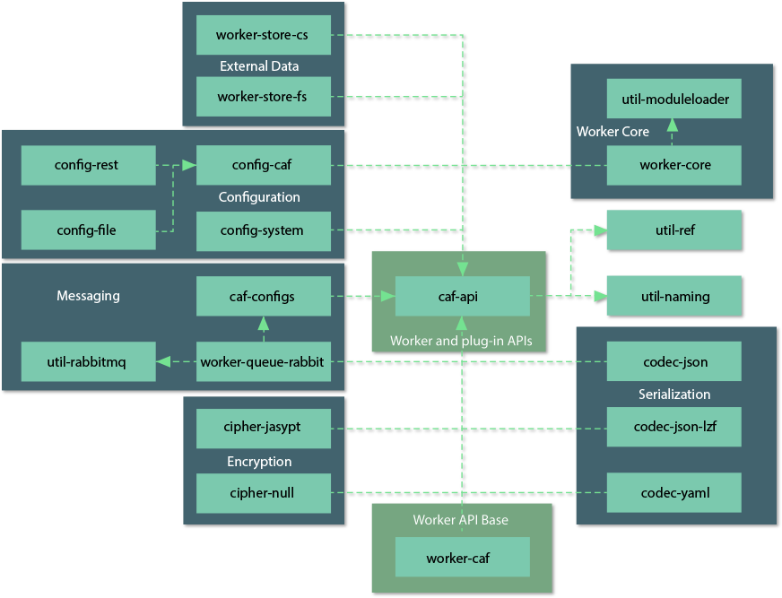
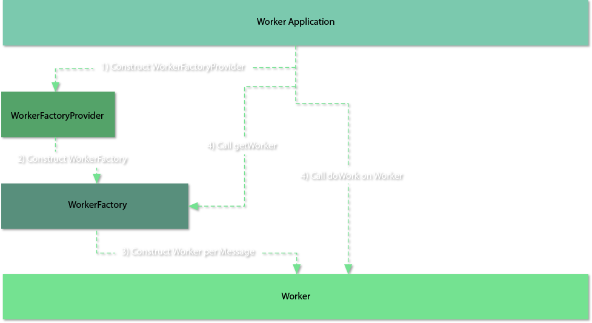

# Architecture
The Worker Framework is a set of Java modules that provide a starting point for developing Worker Microservies. It allows programmers to focus on on adding business value, instead of writing boilerplate code.
It also provides an execution infrastructure code that dynamically loads and runs worker tasks.
The framework promotes best practices through well defined set of interfaces and base classes that developers work against.

## Overview
The Worker Framework is composed of the following main functional parts:
- the worker core application
- APIs for a worker back-end and infrastructure plug-ins:
	- external data storage
	- messaging queue
	- configuration
	- serialization
- default implementations of infrastructure plug-ins

### Worker Core Application
The `worker-core` application manages the flow of data between infrastructure components and a worker back-end. It uses service location mechanism to dynamically detects and load implementations of required components, including worker back-end.

#### Servce Location
The dependency loading mechanism, called servce location, relies on the `util-moduleloader` library which internally uses the [Java ServiceLoader](http://docs.oracle.com/javase/6/docs/api/java/util/ServiceLoader.html). To instantiate a service, the class has to have a parameterless constructor. This is why all of the plug-ins use plug-in providers that instantiate the actual plug-in. They also need to be advertised using the [ServiceLoader](http://docs.oracle.com/javase/6/docs/api/java/util/ServiceLoader.html) mechanism.
Implementations of required components have to be packaged with the `worker-core` application to allow service locator to detect and use them.

When running, application awaits for incoming messages. When a message is received, application will instantiate a [Worker](https://workerframework.github.io/worker-framework/pages/en-us/apidocs/com/hpe/caf/api/worker/Worker.html) implementation and execute the `doWork` method.

To do this, it will use a [WorkerFactoryProvider](https://workerframework.github.io/worker-framework/pages/en-us/apidocs/com/hpe/caf/api/worker/WorkerFactoryProvider.html) located during start-up procedure to obtain a [WorkerFactory](https://workerframework.github.io/worker-framework/pages/en-us/apidocs/com/hpe/caf/api/worker/WorkerFactory.html) which is responsible for construction of a [Worker](https://workerframework.github.io/worker-framework/pages/en-us/apidocs/com/hpe/caf/api/worker/Worker.html) implementation.

#### Worker Factory Provider
The `WorkerFactoryProvider` implementation is responsible for creating an instance of a `WorkerFactory`. It is resolved using the Java ServiceLoader which means it has to have a parameterless constructor. This interface has only a single method, `getWorkerFactory`, called during application start-up.
It is supplied with the following parameters representing worker framework components which can be used in construction of a `WorkerFactory`:
- `configurationSource` used to retrieve worker settings
- `datastore` used for interaction with external data storage
- `codec` used for serialization and de-serialization of messages

#### Worker Factory
The `WorkerFactory` creates a new instance of a `Worker` for each message received. It can supply to a worker any components that were passed to the factory from a WorkerFactoryProvider, including configuration, data store and codec.

`WorkerFactory` requires following methods to be implemented:
- getWorker used to construct a new worker instance and supplied with a worker task data
- getInvalidTaskQueue which should return a name of a queue to be used when task is not recognized
- getWorkerThreads providing the maximum number of threads used by `worker-core` when executing a `Worker` logic

Additionally, developer can implement a `shutdown` method to perform required clean-up of resources when the worker application is closed.

There is a base implementation of the `WorkerFactory` interface, the [AbstractWorkerFactory](https://workerframework.github.io/worker-framework/pages/en-us/apidocs/com/hpe/caf/worker/AbstractWorkerFactory.html), providing support for de-serialization and validation of a task message as well as worker configuration. It should be used whenever possible.

#### Worker

Workers are stateless components designed to perform a specific task. A new worker instance will be created for every task.

Worker receives a task, performs work and outputs a result. `worker-core` application takes care of all interactions with a queueing mechanism.

The main method that developer is required to implement is `doWork()`. It is called by a `worker-core` application per task and return result is expected to be the worker output data.
Other methods that require implementation are:
- `getWorkerIdentifier` which should uniquely identify the worker type
- `getWorkerApiVersion` which should identify the worker input and output API version (task and result)
- `getGeneralFailureResult` which should return a general failure result in case of unhandled exception.

There is a base implementation of the `Worker` interface, the [AbstractWorker](https://workerframework.github.io/worker-framework/pages/en-us/apidocs/com/hpe/caf/worker/AbstractWorker.html). This class provides default implementation of all abstract methods except `doWork`.
It also includes:
- utility functions for creating responses
- default exception handling.
- property for worker task

It should be used as a starting point whenever possible.

#### Worker Error Handling

The general following rules should be adhered to by all Worker implementations:

 - For any explicit failures, return a failure result, not an exception
 - If the input message is not parsable, throw an InvalidTaskException
 - If the task cannot be accepted right now, throw a TaskRejectedException
 - If a transient error occurs in processing, throw a TaskRejectedException
 - If the worker receives an InterruptedException, propagate the InterruptedException
 - If a catastrophic error occurs in processing, throw TaskFailedException

 The `WorkerFactory` should identify whether the task message data is
 parsable and this is the first opportunity to throw an `InvalidTaskException`.
 Once a Worker is created with a task object, the framework will verify the
 object's constraints (if there are any), which is the second chance to throw
 `InvalidTaskException`. The constructor of the `Worker` can throw an
 `InvalidTaskException`. Finally a worker's `doWork()` method can thow an
 `InvalidTaskException`.

 While `InvalidTaskException` is a non-retryable case, there may be retryable
 scenarios for instance a brief disconnection from a temporary resources such as
 a database. If you have a health check in your `WorkerFactory` and this is
 currently failing, you may wish to throw `TaskRejectedException`, which will
 push the task back onto the queue. Once inside a Worker itself, either the
 code or the libraries used should be able to tolerate some amount of transient
 failures in connected resources, but if this still cannot be rectified in a
 reasonable time frame then it is also valid to throw `TaskRejectedException` from
 inside the Worker, with the understanding that any amount of work done so
 far will be abandoned.

 Throwing `TaskFailedException` should be a last resort, for situations that
 should not occur and are not recoverable. Most times, any checked exceptions
 that are caught and are a valid failure case should log the exception, (not
 propagate the exception). Workers derived from `AbstractWorker<>` should then
 call `createFailureResult(...)` perhaps using a sensible enumeration status code
 for your task.

 You do not need to handle the following, as the framework will handle it:

 - The input wrapper not being parsable
 - Connections to the queue dropping
 
#### Poison Messages

 A poison message is a message a worker is unable to handle. A message is
 deemed poisonous during processing when repeated catastrophic failure of the
 worker occurs. Regardless of how many times the message is retried, the worker
 will not be able to handle the message in a graceful manor.

 On receiving a message, a worker will attempt to process the message.  Should
 the worker crash during processing, the message will be returned to the
 `worker-input-queue` by the framework and a retry count append to the message
 headers.  The number of permitted retries is configurable within the
 `RabbitWorkerQueueConfiguration` file for a worker i.e. cfg_caf_dataprocessing_${worker}_RabbitWorkerQueueConfiguration.  
 A message will be retried until successful or until the retry count exceeds the
 permitted number of retries.  If the permitted number of retries is exceeded the
 message will be placed on the `worker-output-queue` by the framework, with a
 task status of “RESULT_EXCEPTION”.
 
### Data Store

Workers often need to interact with an external data storage. Worker Framework supports it by providing the  DataStore interface. A worker can use it to retrieve and store binary data identified by name.
Implementations are pluggable and following are provided out-of-box:
- FileSystem: `worker-store-fs`
- HPE Storage Services: `worker-store-cs`
- AWS S3: `worker-store-s3`

To use a different technology, developers are required to implement the [DataStore](https://workerframework.github.io/worker-framework/pages/en-us/apidocs/com/hpe/caf/api/worker/DataStore.html) interface as well as [DataStoreProvider](https://workerframework.github.io/worker-framework/pages/en-us/apidocs/com/hpe/caf/api/worker/DataStoreProvider.html) supporting the service location.

### Messaging Queue

Workers use message queues to receive work and respond with results. All interactions are handled internally by the framework.
Out-of-box, the Worker Framework uses RabbitMQ but this is a pluggable mechanism. Developers wishing to use a different technology are required to implement the [ManagedWorkerQueue](https://workerframework.github.io/worker-framework/pages/en-us/apidocs/com/hpe/caf/api/worker/ManagedWorkerQueue.html) interface.
[WorkerQueueProvider](https://workerframework.github.io/worker-framework/pages/en-us/apidocs/com/hpe/caf/api/worker/WorkerQueueProvider.html) implementation is also required to support the service location mechanism.

### Configuration

In most cases, workers will require some sort of configuration provided to them. Worker Framework supports it by providing the [ConfigurationSource](https://workerframework.github.io/worker-framework/pages/en-us/apidocs/com/hpe/caf/api/ConfigurationSource.html) interface. It has a single method, `getConfiguration`, that can be used by a worker to retrieve a particular configuration type.
Configuration type is identified by a Java class. ConfigurationSource will retrieve a binary representation of this class from underlying source and de-serialize it.
Out-of-box implementations provided with the framework are:
-  [FileConfigurationSource](https://workerframework.github.io/worker-framework/pages/en-us/apidocs/com/hpe/caf/config/file/FileConfigurationSource.html), which reads configuration from a disk file.
-  [RestConfigurationSource](https://workerframework.github.io/worker-framework/pages/en-us/apidocs/com/hpe/caf/config/rest/RestConfigurationSource.html) which retrieves JSON data from an HTTP REST source.

To use a different source, developers are required to provide an implementation of the [ManagedConfigurationSource](https://workerframework.github.io/worker-framework/pages/en-us/apidocs/com/hpe/caf/api/ManagedConfigurationSource.html) and [ConfigurationSourceProvider](https://workerframework.github.io/worker-framework/pages/en-us/apidocs/com/hpe/caf/api/ConfigurationSourceProvider.html).

#### Encryption of Configuration

Configuration data can be encrypted. This is achieved by the use of [Cipher](https://workerframework.github.io/worker-framework/pages/en-us/apidocs/com/hpe/caf/api/Cipher.html).
By default, the `worker-core` application will use the [NullCipher](https://workerframework.github.io/worker-framework/pages/en-us/apidocs/com/hpe/caf/cipher/NullCipher.html) implementation which does not encrypt or decrypt any data.
Framework also includes the [JasyptCipher](https://workerframework.github.io/worker-framework/pages/en-us/apidocs/com/hpe/caf/cipher/jasypt/JasyptCipher.html) which provides basic text encryption.
Developers can implement their own encryption mechanism by providing an implementation of the Cipher and the [CipherProvider](https://workerframework.github.io/worker-framework/pages/en-us/apidocs/com/hpe/caf/api/CipherProvider.html).

### Serialization

The framework operates on messages which carry a payload with all information required for processig. This information needs to be serialized and de-serialized before it can be used by `worker-core` or a `Worker`. Worker Framework takes care of that internally using the [Codec](https://workerframework.github.io/worker-framework/pages/en-us/apidocs/com/hpe/caf/api/Codec.html) interface. This interface provides format-agnostic methods for serializing and deserializing of an object. There are following codecs provided with the framework:
- [JsonCodec](https://workerframework.github.io/worker-framework/pages/en-us/apidocs/com/hpe/caf/codec/JsonCodec.html) for the JSON format
- [JsonLzfCodec](https://workerframework.github.io/worker-framework/pages/en-us/apidocs/com/hpe/caf/codec/JsonLzfCodec.html) for the JSON format compressed with a high-speed LZF algorithm
- [YamlCodec](https://workerframework.github.io/worker-framework/pages/en-us/apidocs/com/hpe/caf/codec/YamlCodec.html) for the YAML format

To use a different format, developer has to implement the `Codec` and `CodecProvider
